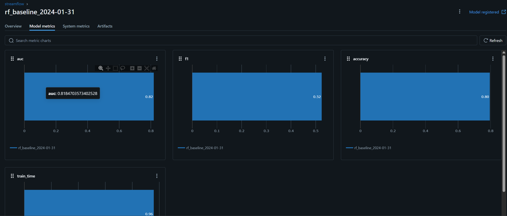
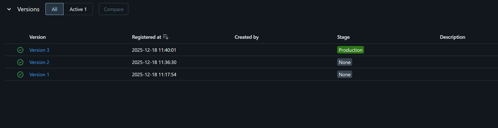

## CI4 : Entraînement end-to-end : MLflow Registry → API de prédiction<

Dans ce TP, vous allez compléter une chaîne MLOps minimale “de bout en bout” : à partir de features déjà disponibles (et déjà matérialisées en ligne), vous construisez un dataset d’entraînement, entraînez un modèle, tracez l’exécution dans MLflow, publiez une version dans le Model Registry, puis servez le modèle via une API FastAPI. L’objectif est de manipuler un flux réaliste et reproductible, centré sur la traçabilité et le déploiement contrôlé.

*   Relier un dataset d’entraînement (point-in-time correct) à un entraînement reproductible.
*   Journaliser une exécution dans MLflow (paramètres, métriques, artefacts) et enregistrer un modèle.
*   Promouvoir une version de modèle en _Production_ via l’interface MLflow.
*   Étendre une API FastAPI pour exposer un endpoint /predict s’appuyant sur le modèle _Production_.
*   Mettre en place des sanity checks simples côté serving (features manquantes, erreurs contrôlées).
*   Documenter les étapes et résultats dans reports/rapport\_tp4.md (commandes, extraits, captures, réflexion).

### Mise en route + rappel de contexte (sanity checks + où on en est dans la pipeline)

Nous reprenons exactement là où vous vous êtes arrêtés au TP3 : les snapshots existent déjà, le repo Feast est déjà en place, et l’online store est déjà matérialisé. Dans ce TP, on ajoute MLflow (tracking + registry) et on commence le “end-to-end” jusqu’à une API de prédiction.

Démarrez la stack Docker Compose et vérifiez que les conteneurs principaux démarrent sans erreur.

Utilisez docker compose ps puis docker compose logs -f \<service> si un service ne démarre pas.

Ajoutez le service **MLflow** dans docker-compose.yml, puis redémarrez la stack.

```yml
  mlflow:
    image: ghcr.io/mlflow/mlflow:v2.16.0
    command: mlflow server --backend-store-uri sqlite:///mlartifacts/mlflow.db --default-artifact-root mlflow-artifacts:/ --host 0.0.0.0 --port 5000 --serve-artifacts --artifacts-destination /mlartifacts/artifacts
    volumes:
      - "./mlartifacts:/mlartifacts"
    ports: ["5000:5000"]


volumes:
  pgdata:
  mlartifacts:
```

Pensez à redémarrer la stack.
>```bash
> $ docker compose down
> $ docker compose up -d
> $ docker compose ps
>  CONTAINER ID   IMAGE                           COMMAND                  CREATED          STATUS          PORTS                                         NAMES
>198904ec5931   ghcr.io/mlflow/mlflow:v2.16.0   "mlflow server --bac…"   9 minutes ago    Up 9 minutes    0.0.0.0:5000->5000/tcp, [::]:5000->5000/tcp   csc8613-mlflow-1
>9c181fe63c35   csc8613-api                     "uvicorn app:app --h…"   19 minutes ago   Up 18 minutes   0.0.0.0:8000->8000/tcp, [::]:8000->8000/tcp   csc8613-api-1
>448063f3a379   csc8613-prefect                 "/usr/bin/tini -g --…"   19 minutes ago   Up 19 minutes             
>                                    csc8613-prefect-1
>d5c71f0fd8d0   csc8613-feast                   "bash -lc 'tail -f /…"   19 minutes ago   Up 19 minutes             
>                                    csc8613-feast-1
>369068f1f247   postgres:16                     "docker-entrypoint.s…"   19 minutes ago   Up 19 minutes   0.0.0.0:5432->5432/tcp, [::]:5432->5432/tcp   csc8613-postgres-1
>```


Objectif : obtenir une UI MLflow accessible localement. On utilise ici une configuration simple et locale (SQLite + volume), suffisante pour le TP.

Vérifiez l’accessibilité des interfaces et endpoints suivants : **MLflow UI** (localhost:5000), **API /health** (localhost:8000).
> ```bash
> $ curl localhost:5000
> <!doctype html><html lang="en"><head><meta charset="utf-8"/><meta name="viewport" content="width=device-width,initial-scale=1,shrink-to-fit=no"/><link rel="shortcut icon" href="./static-files/favicon.ico"/><meta name="theme-color" content="#000000"/><link rel="manifest" href="./static-files/manifest.json" crossorigin="use-credentials"/><title>MLflow</title><script defer="defer" src="static-files/static/js/main.4dd28f2b.js"></script><link href="static-files/static/css/main.4d2fa021.css" rel="stylesheet"></head><body><noscript>You need to enable JavaScript to run this app.</noscript><div id="root"></div><div id="modal"></div></body></html>
>
> $ curl localhost:8000/health
> {"status":"ok"}

Faites un smoke check : vérifiez que la récupération de features _online_ fonctionne toujours via l’endpoint existant /features/{user\_id}.

Choisissez un user\_id dont vous savez qu’il existe (par exemple en regardant la table ou un CSV du TP3). Si vous obtenez des null, c’est souvent un signe que l’online store n’est pas matérialisé, ou que l’ID n’existe pas.
> ```bash
> $ curl localhost:8000/features/4684686-GEFRM
> {"user_id":"4686-GEFRM","features":{"user_id":"4686-GEFRM","monthly_fee":98.69999694824219,"months_active":70,"paperless_billing":true}
> ```

Dans votre rapport reports/rapport\_tp4.md, listez :

1.  les commandes utilisées,
2.  une preuve que chaque service est accessible (captures ou sortie terminal),
3.  un court paragraphe : “quels composants tournent et pourquoi”.

> Pour 1. et 2., vous pouvez voir les résultats des commandes ci-dessus. 
>
>Pour 3., les composants principaux qui tournent sont Postgres (base de données), Feast (feature store), MLflow (tracking + registry) et l’API FastAPI (serving). Chacun est nécessaire pour la chaîne MLOps que nous mettons en place : Postgres stocke les données brutes, Feast gère les features, MLflow trace les entraînements et l’API sert les prédictions.

### Créer un script d’entraînement + tracking MLflow (baseline RandomForest)

Dans cet exercice, vous allez compléter un script train\_baseline.py qui :

1.  construit un dataset d’entraînement via des features déjà disponibles,
2.  entraîne un modèle baseline,
3.  trace l’exécution dans MLflow (params, métriques, artefacts),
4.  enregistre le modèle dans le Model Registry.

  
L’utilisation de l’interface MLflow (promotion en Production, etc.) sera traitée dans l’exercice suivant.

Créez le fichier services/prefect/train\_baseline.py et copiez le squelette ci-dessous. Complétez ensuite les zones marquées par \_\_\_\_\_\_\_ (ce sont vos TODO). Gardez le script exécutable “as-is” dans le conteneur prefect. Le but est d’avoir un entraînement déterministe et traçable (mêmes entrées → mêmes sorties).

```python
import os
import time
import warnings
warnings.filterwarnings("ignore")

import pandas as pd
import numpy as np
from sqlalchemy import create_engine

from feast import FeatureStore
from sklearn.model_selection import train_test_split
from sklearn.metrics import f1_score, roc_auc_score, accuracy_score
from sklearn.ensemble import RandomForestClassifier
from sklearn.compose import ColumnTransformer
from sklearn.preprocessing import OneHotEncoder
from sklearn.pipeline import Pipeline

import mlflow
import mlflow.sklearn
from mlflow.models import ModelSignature
from mlflow.types.schema import Schema, ColSpec

# --------------------
# Config
# --------------------
FEAST_REPO = "/repo"
MODEL_NAME = "streamflow_churn"

AS_OF = os.environ.get("TRAIN_AS_OF", "2024-01-31")

PG_USER = os.environ.get("POSTGRES_USER", "streamflow")
PG_PWD  = os.environ.get("POSTGRES_PASSWORD", "streamflow")
PG_DB   = os.environ.get("POSTGRES_DB", "streamflow")
PG_HOST = os.environ.get("POSTGRES_HOST", "postgres")
PG_PORT = int(os.environ.get("POSTGRES_PORT", "5432"))

MLFLOW_TRACKING_URI = os.environ.get("MLFLOW_TRACKING_URI", "http://mlflow:5000")
MLFLOW_EXPERIMENT   = os.environ.get("MLFLOW_EXPERIMENT", "streamflow")

# --------------------
# Helpers
# --------------------
def get_sql_engine():
    uri = f"postgresql+psycopg2://{PG_USER}:{PG_PWD}@{PG_HOST}:{PG_PORT}/{PG_DB}"
    return create_engine(uri)

def fetch_entity_df(engine, as_of):
    q = """
    SELECT user_id, as_of
    FROM subscriptions_profile_snapshots
    WHERE as_of = %(as_of)s
    """
    df = pd.read_sql(q, engine, params={"as_of": as_of})
    if df.empty:
        raise RuntimeError(f"No snapshot rows found at as_of={as_of}")
    df = df.rename(columns={"as_of": "event_timestamp"})
    df["event_timestamp"] = pd.to_datetime(df["event_timestamp"])
    return df[["user_id", "event_timestamp"]]

def fetch_labels(engine, as_of):
    try:
        q = """
        SELECT user_id, period_start, churn_label
        FROM labels
        WHERE period_start = %(as_of)s
        """
        labels = pd.read_sql(q, engine, params={"as_of": as_of})
        if not labels.empty:
            labels = labels.rename(columns={"period_start": "event_timestamp"})
            return labels[["user_id", "event_timestamp", "churn_label"]]
    except Exception:
        pass

    q2 = "SELECT user_id, churn_label FROM labels"
    labels = pd.read_sql(q2, engine)
    if labels.empty:
        raise RuntimeError("Labels table is empty.")
    labels["event_timestamp"] = pd.to_datetime(AS_OF)
    return labels[["user_id", "event_timestamp", "churn_label"]]

def build_training_set(store, entity_df, features):
    hf = store.get_historical_features(
        entity_df=entity_df,
        features=features,
    )
    return hf.to_df()

def prep_xy(df, label_col="churn_label"):
    y = df[label_col].astype(int).values
    X = df.drop(columns=[label_col, "user_id", "event_timestamp"], errors="ignore")
    return X, y

# --------------------
# Main
# --------------------
def main():
    # TODO 1: configurer MLflow (tracking URI + experiment) en écrivant les bonnes constantes
    mlflow.set_tracking_uri(____________)
    mlflow.set_experiment(____________)


    engine = get_sql_engine()

    entity_df = fetch_entity_df(engine, AS_OF)
    labels = fetch_labels(engine, AS_OF)

    # TODO 2: définir la liste des features Feast à récupérer (liste de strings). Voir lab précédent
    # pour le nom des features
    features = [
        _______,
        _______,
        _______,
        _______,
        _______,
        _______,

        _______,
        _______,
        _______,
        _______,
        _______,

        _______,

        _______,
        _______,
    ]

    store = FeatureStore(repo_path=FEAST_REPO)
    feat_df = build_training_set(store, entity_df, features)

    # TODO 3: fusionner features + labels avec une jointure sur (user_id, event_timestamp)
    # Inspirez-vous du TP précédent
    df = _______

    if df.empty:
        raise RuntimeError("Training set is empty after merge. Check AS_OF and labels.")

    # Feature engineering minimal
    cat_cols = [c for c in df.columns if df[c].dtype == "object" and c not in ["user_id", "event_timestamp"]]
    num_cols = [c for c in df.columns if c not in cat_cols + ["user_id", "event_timestamp", "churn_label"]]

    X, y = prep_xy(df)

    # TODO 4: construire le préprocessing (OneHot sur cat + passthrough sur num)
    preproc = ColumnTransformer(
        transformers=[
            ("cat", _______, cat_cols),
            ("num", _______, num_cols),
        ],
        remainder="drop"
    )

    # TODO 5: définir le modèle RandomForest (avec un random_state fixé de manière arbitraire)
    clf = RandomForestClassifier(
        n_estimators=300,
        n_jobs=-1,
        random_state=_______,
        class_weight="balanced",
        max_features="sqrt",
    )

    # TODO 6: Finissez de définir la pipeline
    pipe = Pipeline(steps=[("prep", ________), ("clf", _________)])

    X_train, X_val, y_train, y_val = train_test_split(
        X, y, test_size=0.25, random_state=42, stratify=y
    )

    # TODO 7: démarrer un run MLflow, entraîner, calculer métriques, logger (params + metrics)
    # Cherchez la fonction permettant de démarrer un run
    with mlflow._________(run_name=f"rf_baseline_{AS_OF}") as run:
        start = time.time()
        pipe.fit(X_train, y_train)
        train_time = time.time() - start

        if hasattr(pipe, "predict_proba"):
            y_val_proba = pipe.predict_proba(X_val)[:, 1]
            auc = roc_auc_score(y_val, y_val_proba)
        else:
            auc = float("nan")

        y_val_pred = pipe.predict(X_val)
        f1  = f1_score(y_val, y_val_pred)
        acc = accuracy_score(y_val, y_val_pred)

       	# TODO7.1 log params + metrics
       	# Loggez le type de modèle, AUC, F1, ACC (sur val) et le train time
       	# de la même manière que la ligne suivante :
       	mlflow.log_param("as_of", AS_OF)
        _______
        _______
        _______
        _______
        _______
        _______

        # TODO 7: logger un artefact JSON qui décrit cat_cols et num_cols
        mlflow.log_dict(
            {"categorical_cols": ________,
             "numeric_cols": ________},
            "feature_schema.json"
        )

        # TODO 8: créer une signature MLflow (inputs + outputs) puis enregistrer le modèle dans le Registry
	# À adapter avec vos features
        input_schema = Schema(
            [
                ColSpec("long", "months_active"),
                ColSpec("double", "monthly_fee"),
                ColSpec("boolean", "paperless_billing"),
                ColSpec("boolean", "plan_stream_tv"),
                ColSpec("boolean", "plan_stream_movies"),
                ColSpec("string", "net_service"),
                ColSpec("double", "watch_hours_30d"),
                ColSpec("double", "avg_session_mins_7d"),
                ColSpec("long", "unique_devices_30d"),
                ColSpec("long", "skips_7d"),
                ColSpec("long", "rebuffer_events_7d"),
                ColSpec("long", "failed_payments_90d"),
                ColSpec("long", "support_tickets_90d"),
                ColSpec("double", "ticket_avg_resolution_hrs_90d"),
            ]
        )
        output_schema = Schema([ColSpec("long", "prediction")])
        signature = ModelSignature(inputs=_________, outputs=__________)

        mlflow.sklearn.log_model(
            sk_model=_______,  # TODO 9 : faut-il mettre pipe ou clf ? Expliquez pourquoi dans le rapport
            artifact_path="model",
            registered_model_name=MODEL_NAME,
            signature=signature
        )

        print(f"[OK] Trained baseline RF. AUC={auc:.4f} F1={f1:.4f} ACC={acc:.4f} (run_id={run.info.run_id})")

if __name__ == "__main__":
    main()
```
> Pour le TODO 9, il faut mettre pipe car c’est la pipeline complète (préprocessing + modèle) qui doit être enregistrée et servie.


Exécutez votre script train\_baseline.py dans le conteneur prefect sur month\_000 avec

```bash
docker compose exec -e TRAIN_AS_OF=_________ prefect \
  python /opt/prefect/flows/train_baseline.py
```

Vérifiez qu’il se termine avec un message \[OK\] et un run\_id.
> ```bash
> Successfully registered model 'streamflow_churn'.
>2025/12/18 10:17:54 INFO mlflow.store.model_registry.abstract_store: Waiting up to 300 seconds for model version to finish creation. Model name: streamflow_churn, version 1
>Created version '1' of model 'streamflow_churn'.
>[OK] Trained baseline RF. AUC=0.8185 F1=0.5244 ACC=0.7950 (run_id=ba2341d96a8441d3936e520a06ddfe12)
>2025/12/18 10:17:54 INFO mlflow.tracking._tracking_service.client: 🏃 View run rf_baseline_2024-01-31 at: http://mlflow:5000/#/experiments/1/runs/ba2341d96a8441d3936e520a06ddfe12.
>2025/12/18 10:17:54 INFO mlflow.tracking._tracking_service.client: 🧪 View experiment at: http://mlflow:5000/#/experiments/1.
>> ```

Le script doit pouvoir accéder à Postgres, Feast, et MLflow via le réseau Docker Compose. Assurez-vous que la variable MLFLOW\_TRACKING\_URI pointe vers http://mlflow:5000 côté conteneur.

> On fait un petit test via python:
> ```bash
> $ docker compose exec prefect python -c "import requests; print(requests.get('http://mlflow:5000').status_code)"
>200
> ```
> Le code 200 indique que l'API MLflow est accessible depuis le conteneur prefect.

Dans votre rapport reports/rapport\_tp4.md, indiquez :

1.  la valeur de AS\_OF utilisée,
> 2024-01-31
2.  le nombre de lignes de votre dataset d’entraînement (après merge),
> 5282
3.  les colonnes catégorielles détectées (cat\_cols),
> ['net_service']
4.  les trois métriques calculées (AUC, F1, ACC) et le temps d’entraînement.
> AUC=0.8185 F1=0.5244 ACC=0.7950
> train_time=0.9559

Toujours dans le rapport, expliquez en 5–8 lignes pourquoi on fixe :

*   AS\_OF et
*   random\_state,

dans un pipeline MLOps orienté reproductibilité.
> On fixe AS_OF et random_state pour garantir la reproductibilité des résultats.

### Explorer l’interface MLflow et promouvoir un modèle

Dans cet exercice, vous n’écrivez pas de code. L’objectif est de comprendre comment MLflow structure l’information liée à un entraînement (runs, métriques, artefacts) et comment le Model Registry permet de piloter le cycle de vie d’un modèle via des _stages_.

Ouvrez l’interface graphique de MLflow et identifiez l’expérience associée à votre entraînement (MLFLOW\_EXPERIMENT, par défaut streamflow).

L’UI MLflow est accessible sur http://localhost:5000. Si aucune expérience n’apparaît, vérifiez que votre script s’est bien exécuté et que MLFLOW\_TRACKING\_URI est correctement configurée.

Sélectionnez le run correspondant à votre exécution de train\_baseline.py et explorez : les paramètres, les métriques et les artefacts associés.

Accédez au **Model Registry** dans l’UI MLflow et localisez le modèle streamflow\_churn qui a été enregistré par votre script.

Le Model Registry est accessible via l’onglet “Models”. Chaque version correspond à un run ayant enregistré un modèle.

Depuis l’interface MLflow, promouvez la dernière version du modèle streamflow\_churn vers le stage **Production**. Par simplicité, utiliser l'ancien interface ("New model registry UI" sur off sur la page de la version) et modifié le Stage.

Vérifiez dans le Model Registry qu’une (et une seule) version du modèle est désormais en **Production**, et notez son numéro de version.

Dans votre rapport reports/rapport\_tp4.md, incluez :

*   une capture de l’UI MLflow montrant le run (métriques + artefacts),

*   une capture du Model Registry avec le modèle en **Production**,

*   le numéro de version promu. 
> Version 3

Expliquez en 5–8 lignes pourquoi la promotion via une interface (stages _None_, _Staging_, _Production_) est préférable à un déploiement manuel basé sur des fichiers ou des chemins locaux.
> La promotion via une interface offre une gestion centralisée et structurée des modèles, facilitant le suivi des versions et des états. De plus, il permet aux équipes de modifier plus facilement quel modèle est utilisé en prod.

### Étendre l’API pour exposer /predict (serving minimal end-to-end)

Objectif : passer d’un endpoint “features” à un vrai endpoint de prédiction. On garde volontairement l’API simple :

*   récupérer les features online déjà matérialisées,
*   construire un DataFrame 1 ligne,
*   charger le modèle MLflow en **Production**,
*   retourner une prédiction (et optionnellement une probabilité).

  

Modifiez les requirements.txt de l'API par :

```text
fastapi
cloudpickle==3.0.0
uvicorn[standard]==0.30.6
pydantic
scikit-learn==1.7.2
mlflow==2.16.0
feast==0.56.0
pandas==2.3.3
prometheus-client==0.23.1
psycopg2-binary==2.9.11
psycopg-binary==3.2.12
psycopg-pool==3.2.7
psycopg==3.2.12
structlog==24.4.0
python-json-logger==2.0.7
```

Ajoutez MLFLOW\_TRACKING\_URI=http://mlflow:5000 dans .env.

Modifiez api/app.py pour ajouter un endpoint POST /predict. Vous devez aussi charger le Feature Store et le modèle MLflow “Production”. Contrainte importante : l’API s’exécute dans Docker. Dans le conteneur, l’URI MLflow n’est pas http://localhost:5000 mais http://mlflow:5000 (nom du service Docker).

Ci-dessous, un squelette minimal basé sur votre api/app.py actuel. Complétez uniquement les zones \_\_\_\_\_\_\_. Le reste est fourni.

```python
from fastapi import FastAPI
from pydantic import BaseModel
from feast import FeatureStore
import mlflow.pyfunc
import pandas as pd
import os

app = FastAPI(title="StreamFlow Churn Prediction API")

# --- Config ---
REPO_PATH = "/repo"
# TODO 1: complétez avec le nom de votre modèle
MODEL_URI = "models:/__________/Production"

try:
    store = FeatureStore(repo_path=REPO_PATH)
    model = mlflow.pyfunc.load_model(MODEL_URI)
except Exception as e:
    print(f"Warning: init failed: {e}")
    store = None
    model = None


class UserPayload(BaseModel):
    user_id: str


@app.get("/health")
def health():
    return {"status": "ok"}


# TODO 2: Mettre une requête POST
@app._______("/predict")
def predict(payload: UserPayload):
    if store is None or model is None:
        return {"error": "Model or feature store not initialized"}

    # TODO (optionel) à adapter si besoin
    features_request = [
            "subs_profile_fv:months_active",
            "subs_profile_fv:monthly_fee",
            "subs_profile_fv:paperless_billing",
            "subs_profile_fv:plan_stream_tv",
            "subs_profile_fv:plan_stream_movies",
            "subs_profile_fv:net_service",
            "usage_agg_30d_fv:watch_hours_30d",
            "usage_agg_30d_fv:avg_session_mins_7d",
            "usage_agg_30d_fv:unique_devices_30d",
            "usage_agg_30d_fv:skips_7d",
            "usage_agg_30d_fv:rebuffer_events_7d",
            "payments_agg_90d_fv:failed_payments_90d",
            "support_agg_90d_fv:support_tickets_90d",
            "support_agg_90d_fv:ticket_avg_resolution_hrs_90d",
        ]


    # TODO 3 : Récupérer les features online
    feature_dict = store.__________________(
            features=features_request,
            entity_rows=[{"user_id": payload.user_id}],
        ).to_dict()

    X = pd.DataFrame({k: [v[0]] for k, v in feature_dict.items()})

    # Gestion des features manquantes
    if X.isnull().any().any():
            missing = X.columns[X.isnull().any()].tolist()
            return {
                "error": f"Missing features for user_id={payload.user_id}",
                "missing_features": missing,
            }

    # Nettoyage minimal (évite bugs de types)
    X = X.drop(columns=["user_id"], errors="ignore")

    # TODO 4: appeler le modèle et produire la réponse JSON (prediction + proba optionnelle)
    # Astuce : la plupart des modèles MLflow “pyfunc” utilisent model.predict(X)
    # (on ne suppose pas predict_proba ici)
    y_pred = _______

    # TODO 5 : Retourner la prédiction
    return {
        "user_id": payload.user_id,
        "prediction": int(_________),
        "features_used": X.to_dict(orient="records")[0],
    }
```


Redémarrez uniquement le service api (pas toute la stack) en regénérant l'image à partir du Dockerfile de l'API si nécessaire, puis vérifiez que l’API est accessible.

Testez POST /predict avec un user\_id valide via Swagger UI ou via curl.

Swagger UI est accessible sur http://localhost:8000/docs. Pour curl, pensez au header Content-Type: application/json.

Dans votre rapport reports/rapport\_tp4.md, incluez :

*   une requête réussie (capture Swagger ou commande curl),
> curl -X POST "http://localhost:8000/predict" \
     -H "Content-Type: application/json" \
     -d '{"user_id": "4686-GEFRM"}'
*   la réponse JSON obtenue.
> {"user_id":"4686-GEFRM","prediction":0,"features_used":{"paperless_billing":true,"months_active":70,"plan_stream_tv":false,"plan_stream_movies":true,"net_service":"Fiber optic","monthly_fee":98.69999694824219,"skips_7d":8,"watch_hours_30d":47.489646911621094,"avg_session_mins_7d":29.14104461669922,"unique_devices_30d":2,"rebuffer_events_7d":2,"failed_payments_90d":0,"support_tickets_90d":0,"ticket_avg_resolution_hrs_90d":13.600000381469727}}

Dans votre rapport, expliquez en 5–8 lignes pourquoi le modèle chargé par l’API doit pointer vers models:/streamflow\_churn/Production et pas vers un fichier local (.pkl) ou un artifact de run.
> Le modèle doit pointer vers models:/streamflow_churn/Production pour garantir que l'API utilise toujours la version la plus récente et validée du modèle en production. Cela permet une gestion centralisée des modèles, facilitant les mises à jour et les déploiements sans avoir à modifier le code de l'API. De plus, cela assure une traçabilité et une auditabilité des modèles utilisés, ce qui est crucial pour la conformité et la maintenance.

### Robustesse du serving : cas d’échec réalistes (sans monitoring)

Objectif : confronter l’API à des cas d’échec réalistes et mettre en place des garde-fous minimaux, **sans** introduire de monitoring (drift, alerting, dashboards, etc.).  
En production, beaucoup de pannes “modèle” sont en réalité des pannes “features” (entités absentes, online store incomplet, valeurs nulles, types inattendus).

Testez POST /predict avec un user\_id dont vous savez qu’il existe. Conservez la commande (ou capture Swagger) et la réponse JSON.
> curl -X POST "http://localhost:8000/predict" \
     -H "Content-Type: application/json" \
     -d '{"user_id": "4686-GEFRM"}'
> 
>{"user_id":"4686-GEFRM","prediction":0,"features_used":{"paperless_billing":true,"months_active":70,"plan_stream_tv":false,"plan_stream_movies":true,"net_service":"Fiber optic","monthly_fee":98.69999694824219,"skips_7d":8,"watch_hours_30d":47.489646911621094,"avg_session_mins_7d":29.14104461669922,"unique_devices_30d":2,"rebuffer_events_7d":2,"failed_payments_90d":0,"support_tickets_90d":0,"ticket_avg_resolution_hrs_90d":13.600000381469727}}

Testez POST /predict avec un user\_id qui a de fortes chances de ne pas exister dans l’online store (ex : 999999). Observez le comportement actuel de votre API.
> curl -X POST "http://localhost:8000/predict" \
     -H "Content-Type: application/json" \
     -d '{"user_id": "999999"}'
>
> {"error":"Missing features for user_id=999999","missing_features":["paperless_billing","months_active","plan_stream_tv","plan_stream_movies","net_service","monthly_fee","skips_7d","watch_hours_30d","avg_session_mins_7d","unique_devices_30d","rebuffer_events_7d","failed_payments_90d","support_tickets_90d","ticket_avg_resolution_hrs_90d"]}

En pratique, un user\_id absent peut produire :

*   un dictionnaire de features avec des valeurs null,
*   ou une réponse incohérente si l’on ne contrôle pas les valeurs manquantes.

Dans votre rapport reports/rapport\_tp4.md, fournissez :

*   un exemple de requête qui réussit (commande/capture) + la réponse JSON,
*   un exemple de requête qui échoue (commande/capture) + la réponse JSON d’erreur (avec missing\_features),
*   un court paragraphe “ce qui peut mal tourner en serving et comment on le détecte tôt”. Dans ce paragraphe, discutez au minimum ces deux causes (sans refaire Feast) :
    *   **Entité absente** : le user\_id demandé n’est pas présent dans l’online store.
    *   **Online store incomplet / obsolète** : la matérialisation est manquante ou n’est pas à jour (stale), ce qui se traduit par des valeurs manquantes côté API.

> Ce qui peut mal tourner en serving et comment on le détecte tôt :
> 1. Entité absente : Si le user_id demandé n'existe pas dans l'online store, l'API renvoie une erreur indiquant les features manquantes. Cela permet de détecter rapidement que l'entité n'est pas présente.
> 2. Online store incomplet / obsolète : Si la matérialisation des features n'est pas à jour, certaines valeurs peuvent être nulles. L'API vérifie la présence de valeurs manquantes et renvoie une erreur avec la liste des features manquantes, permettant ainsi de détecter les problèmes liés à l'online store.


### Réflexion de synthèse (ingénierie MLOps)

Cet exercice est volontairement court et sans code. L’objectif est de prendre du recul et de relier toutes les briques manipulées dans ce TP : données, features, entraînement, tracking, registry et serving.  
À ce stade, on ne traite **pas** encore le monitoring, le drift ou le retraining automatique.  
Dans votre rapport reports/rapport\_tp4.md, répondez aux questions suivantes.

Attendu : des réponses concrètes et techniques, pas des définitions génériques. Appuyez-vous sur ce que vous avez réellement mis en place dans ce TP.

Expliquez ce que MLflow garantit dans cette pipeline :

*   au niveau de la traçabilité des entraînements,
*   au niveau de l’identification des modèles servis.

Expliquez ce que signifie concrètement le stage **Production** pour l’API :

*   comment le modèle est sélectionné au démarrage,
*   ce que cela permet (ou empêche) côté déploiement.

Identifiez au moins trois points où la reproductibilité peut encore casser dans ce système, même avec MLflow (exemples : données, code, configuration, environnement).

Vous pouvez structurer votre réponse en courts paragraphes ou en liste, tant que le total reste dans une limite raisonnable (10–15 lignes).

> MLflow garantit la traçabilité des entraînements en enregistrant les paramètres, métriques et artefacts de chaque run, permettant ainsi de reproduire les résultats. Pour l'identification des modèles servis, MLflow utilise le Model Registry, où chaque modèle est versionné et peut être promu à différents stades (None, Staging, Production).
> Le stage Production pour l'API signifie que le modèle utilisé est toujours la version la plus récente et validée du modèle en production. Au démarrage, l'API charge le modèle à partir de l'URI "models:/streamflow_churn/Production", assurant ainsi que le modèle servi est celui qui a été promu en Production. Cela permet une gestion centralisée des modèles, facilitant les mises à jour sans modifier le code de l'API.
> Trois points où la reproductibilité peut encore casser sont :
> 1. Données : Si les données d'entraînement changent ou si les snapshots ne sont pas figés, les résultats peuvent varier.
> 2. Code : Si le code d'entraînement ou de préprocessing change sans versionnement, cela peut affecter la reproductibilité.
> 3. Environnement : Les différences dans les versions des bibliothèques ou des dépendances entre les environnements peuvent entraîner des comportements inattendus.
