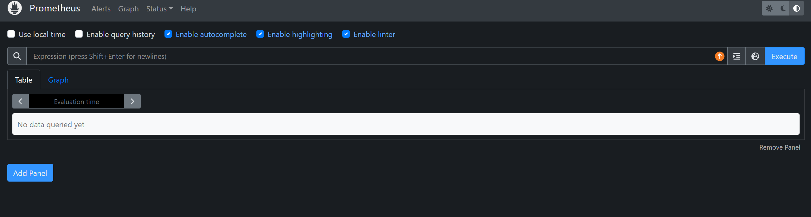
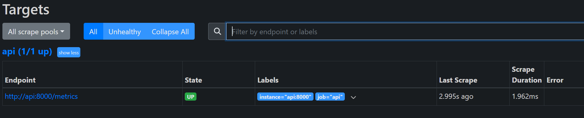
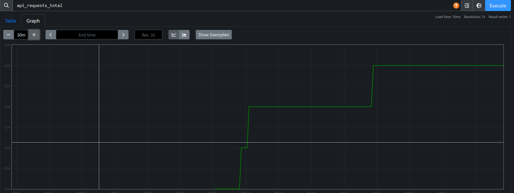
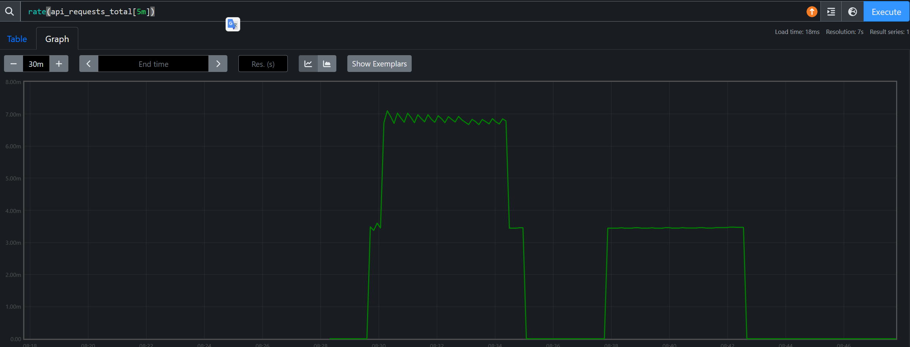
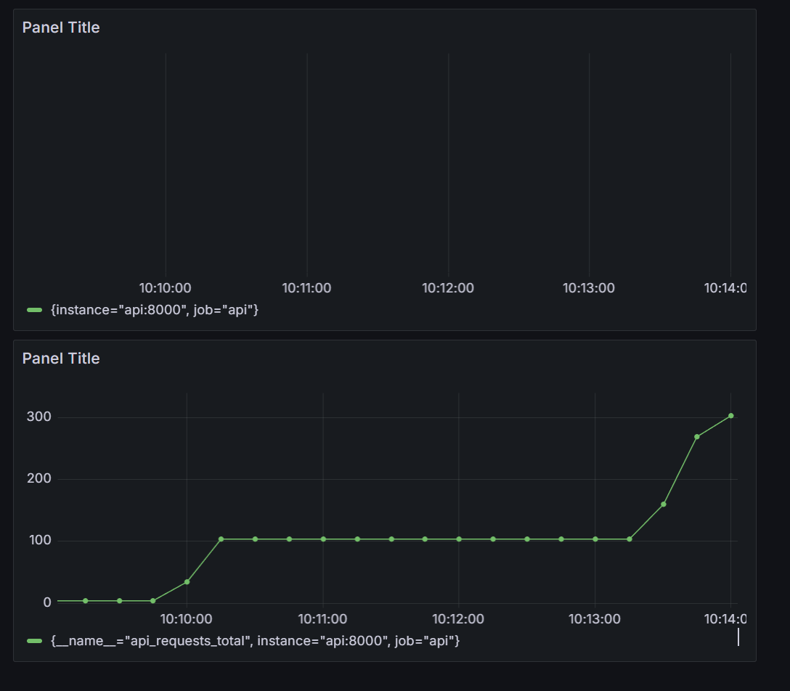
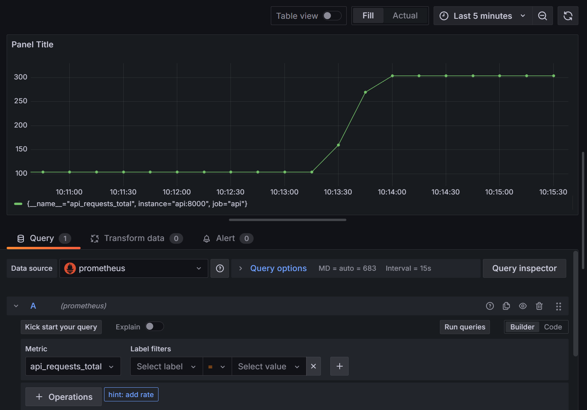
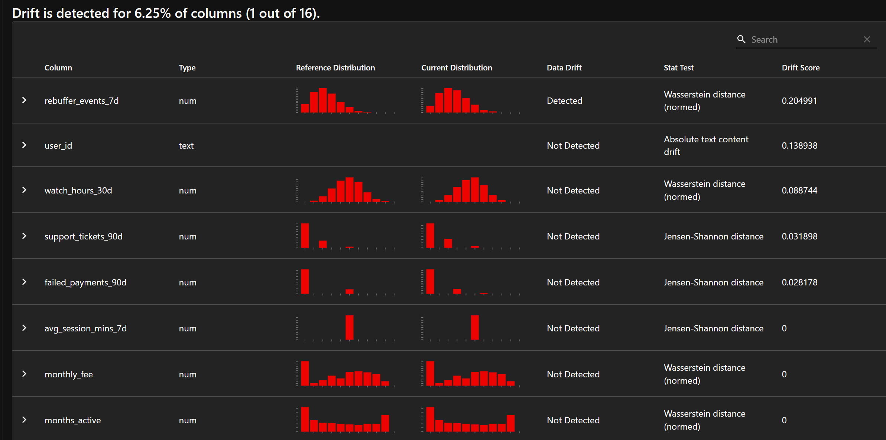

## CI5 : Monitoring et observabilité

Ce cinquième TP marque une étape clé du cours : jusqu’à présent, vous avez construit un système de machine learning fonctionnel et reproductible, capable d’ingérer des données, de calculer des features, d’entraîner un modèle et de servir des prédictions via une API. Dans ce TP, l’objectif est désormais de **rendre ce système observable** et de lui donner la capacité de **détecter des dégradations silencieuses** liées à l’évolution des données dans le temps.

Vous allez mettre en place une stack de monitoring complète autour de votre API de prédiction (Prometheus et Grafana), instrumenter le service pour exposer des métriques pertinentes, puis implémenter une détection de drift basée sur Evidently afin de comparer des données de référence et des données récentes. Enfin, vous connecterez cette détection à une logique de décision simulant un déclenchement de réentraînement.

Ce TP est volontairement pragmatique et orienté ingénierie : il ne s’agit pas d’optimiser un modèle, mais de comprendre comment observer un système ML en production, interpréter ses signaux, et poser les bases d’une automatisation robuste.

*   Comprendre le rôle de l’observabilité dans un système de machine learning en production.
*   Déployer et configurer une stack de monitoring avec Prometheus et Grafana.
*   Instrumenter une API FastAPI pour exposer des métriques de trafic et de latence.
*   Explorer et interpréter des métriques via l’interface Prometheus et des dashboards Grafana.
*   Détecter un drift de données entre deux périodes à l’aide d’Evidently.
*   Produire des artefacts de monitoring et de drift exploitables (rapports, métriques).
*   Implémenter une logique de décision simulant un déclenchement de réentraînement basé sur le drift.

### Démarrer la stack pour l'observabilité

Dans cet exercice, l’objectif est uniquement de démarrer Prometheus + Grafana dans votre stack Docker Compose et de valider l’accès aux interfaces web. Aucune instrumentation de l’API n’est demandée ici.

Mettez à jour votre docker-compose.yml pour inclure les services **prometheus** et **grafana**. Le code est le suivant :

```yaml
prometheus:
  image: prom/prometheus:v2.55.1
  container_name: streamflow-prometheus
  volumes:
    - ./services/prometheus/prometheus.yml:/etc/prometheus/prometheus.yml:ro
  command:
    - "--config.file=/etc/prometheus/prometheus.yml"
  ports:
    - "9090:9090"
  depends_on:
    - api

grafana:
  image: grafana/grafana:11.2.0
  container_name: streamflow-grafana
  volumes:
    - ./services/grafana/provisioning:/etc/grafana/provisioning
    - grafana-data:/var/lib/grafana
  ports:
    - "3000:3000"
  depends_on:
    - prometheus
```

Et en bas du fichier :

```yaml
volumes: 
    pgdata: 
    mlartifacts: 
    grafana-data:
```

Ajoutez dans les volumes de prefect:

```yaml
      - ./reports:/reports # Pour ecrire les rapports
```

Créez le fichier services/prometheus/prometheus.yml et ajoutez-y:

```yaml
global:
  scrape_interval: 10s

scrape_configs:
  - job_name: "api"
    metrics_path: /metrics
    static_configs:
      - targets: ["api:8000"]
```

Le point important est api:8000 : dans un réseau Docker Compose, les conteneurs communiquent via le nom de service (ici api), pas via localhost.

Créez la structure de répertoires de provisioning Grafana suivante (même si certains répertoires sont vides au début) :

*   services/grafana/provisioning/datasources/
*   services/grafana/provisioning/dashboards/
*   services/grafana/provisioning/dashboards/json/

Démarrez (ou redémarrez) la stack et vérifiez que tous les services sont **Up**.

*   Lancez docker compose up -d
*   Puis vérifiez avec docker compose ps

Validez l’accès aux interfaces web :

*   Prometheus : http://localhost:9090
*   Grafana : http://localhost:3000

Identifiez aussi les noms de conteneurs (via docker compose ps) et expliquez en une phrase pourquoi Prometheus utilise api:8000 au lieu de localhost:8000.

Dans votre rapport reports/rapport\_tp5.md, ajoutez :

*   Un court transcript terminal montrant docker compose up -d et/ou docker compose ps.

> ```bash
> $ docker compose ps
> NAME                    IMAGE                           COMMAND                  SERVICE      CREATED          STATUS          PORTS
> csc8613-api-1           csc8613-api                     "uvicorn app:app --h…"   api          3 weeks ago      Up 25 seconds   0.0.0.0:8000->8000/tcp, [::]:8000->8000/tcp
> csc8613-feast-1         csc8613-feast                   "bash -lc 'tail -f /…"   feast        3 weeks ago      Up 26 seconds
> csc8613-mlflow-1        ghcr.io/mlflow/mlflow:v2.16.0   "mlflow server --bac…"   mlflow       3 weeks ago      Up 26 seconds   0.0.0.0:5000->5000/tcp, [::]:5000->5000/tcp
> csc8613-postgres-1      postgres:16                     "docker-entrypoint.s…"   postgres     3 weeks ago      Up 26 seconds   0.0.0.0:5432->5432/tcp, [::]:5432->5432/tcp
> streamflow-grafana      grafana/grafana:11.2.0          "/run.sh"                grafana      27 seconds ago   Up 25 seconds   0.0.0.0:3000->3000/tcp, [::]:3000->3000/tcp
> streamflow-prometheus   prom/prometheus:v2.55.1         "/bin/prometheus --c…"   prometheus   27 seconds ago   Up 25 seconds   0.0.0.0:9090->9090/tcp, [::]:9090->9090/tcp
> ```
*   Une capture d’écran de la page d’accueil Prometheus.



*   Une capture d’écran de l’écran de login ou d’accueil Grafana.


### Instrumentation de FastAPI avec de métriques Prometheus

exposer un endpoint /metrics et mesurer **volume** et **latence** des requêtes. Nous utilisons ici prometheus\_client directement (pas de middleware externe). Attention : ne mettez jamais user\_id comme label Prometheus (cardinalité trop élevée).

Dans api/app.py, ajoutez le strict nécessaire pour exporter des métriques Prometheus :

*   Un compteur api\_requests\_total (Counter)
*   Un histogramme api\_request\_latency\_seconds (Histogram)
*   Un endpoint HTTP /metrics qui renvoie le format Prometheus

Pour vous guider, copiez/collez le squelette ci-dessous dans votre fichier et complétez uniquement les zones marquées **TODO** et **\_\_\_\_\_**.

```python
from prometheus_client import Counter, Histogram, generate_latest, CONTENT_TYPE_LATEST
from fastapi.responses import Response
import time

# TODO: Créez les métriques avec les noms suivants:
# un Counter: "api_requests_total"
# un Histogram: "api_request_latency_seconds"
REQUEST_COUNT = _____("api_requests_total", "Total number of API requests")
REQUEST_LATENCY = _____("api_request_latency_seconds", "Latency of API requests in seconds")


@app.______("/predict")
def predict(payload: UserPayload):
    # TODO: prendre le temps au départ avec time
    start_time = _______

    # TODO: incrementiez le request counter
    REQUEST_COUNT._____()

    # Logique devant normalement exister dans votre code
    if store is None or model is None:
        return {"error": "Model or feature store not initialized"}

    features_request = [
    #...
    

    X = X.drop(columns=["user_id"], errors="ignore")
    y_pred = ...

    # TODO: observe latency in seconds (end - start)
    REQUEST_LATENCY._____(time.time() - start_time)

    return {
        "user_id": payload.user_id,
        "prediction": int(_____),
        "features_used": X.to_dict(orient="records")[0],
    }


@app.get("/metrics")
def metrics():
    # TODO: returnez une Response avec generate_latest() et CONTENT_TYPE_LATEST comme type de media
    return _____(generate_latest(), media_type=_____)
```

L’histogramme enregistre une distribution (via des buckets). C’est ce qui permet d’estimer des percentiles (p95/p99) et d’observer la “tail latency”. Une moyenne seule masque souvent les cas lents.

Vérifiez que l’endpoint /metrics fonctionne :

*   Démarrez/re-démarrez l’API
*   Exécutez curl http://localhost:8000/metrics
*   Appelez /predict quelques fois et re-checkez /metrics

Vous devez constater que :

*   api\_requests\_total augmente
*   api\_request\_latency\_seconds contient des lignes de buckets

Dans votre rapport reports/rapport\_tp5.md, ajoutez :

*   Une capture d’écran (ou un court extrait copié/collé) de /metrics montrant vos deux métriques et au moins une ligne.
> ```bash
> $ curl http://localhost:8000/metrics
> # HELP python_gc_objects_collected_total Objects collected during gc
> # TYPE python_gc_objects_collected_total counter
> python_gc_objects_collected_total{generation="0"} 5773.0
> python_gc_objects_collected_total{generation="1"} 4513.0
> python_gc_objects_collected_total{generation="2"} 882.0
> # HELP python_gc_objects_uncollectable_total Uncollectable objects found during GC
> # TYPE python_gc_objects_uncollectable_total counter
> python_gc_objects_uncollectable_total{generation="0"} 0.0
> python_gc_objects_uncollectable_total{generation="1"} 0.0
> python_gc_objects_uncollectable_total{generation="2"} 0.0
> # HELP python_gc_collections_total Number of times this generation was collected
> # TYPE python_gc_collections_total counter
> python_gc_collections_total{generation="0"} 1437.0
> python_gc_collections_total{generation="1"} 130.0
> python_gc_collections_total{generation="2"} 11.0
> # HELP python_info Python platform information
> # TYPE python_info gauge
> python_info{implementation="CPython",major="3",minor="11",patchlevel="14",version="3.11.14"} 1.0
> # HELP process_virtual_memory_bytes Virtual memory size in bytes.
> # TYPE process_virtual_memory_bytes gauge
> process_virtual_memory_bytes 2.455269376e+09
> # HELP process_resident_memory_bytes Resident memory size in bytes.
> # TYPE process_resident_memory_bytes gauge
> process_resident_memory_bytes 3.71228672e+08
> # HELP process_start_time_seconds Start time of the process since unix epoch in seconds.
> # TYPE process_start_time_seconds gauge
> process_start_time_seconds 1.7679472676e+09
> # HELP process_cpu_seconds_total Total user and system CPU time spent in seconds.
> # TYPE process_cpu_seconds_total counter
> process_cpu_seconds_total 9.24
> # HELP process_open_fds Number of open file descriptors.
> # TYPE process_open_fds gauge
> process_open_fds 16.0
> # HELP process_max_fds Maximum number of open file descriptors.
> # TYPE process_max_fds gauge
> process_max_fds 1.048576e+06
> # HELP feast_feature_server_cpu_usage CPU usage of the Feast feature server
> # TYPE feast_feature_server_cpu_usage gauge
> feast_feature_server_cpu_usage 0.0
> # HELP feast_feature_server_memory_usage Memory usage of the Feast feature server
> # TYPE feast_feature_server_memory_usage gauge
> feast_feature_server_memory_usage 0.0
> # HELP api_requests_total Total number of API requests
> # TYPE api_requests_total counter
> api_requests_total 0.0
> # HELP api_requests_created Total number of API requests
> # TYPE api_requests_created gauge
> api_requests_created 1.7679472763333416e+09
> # HELP api_request_latency_seconds Latency of API requests in seconds
> # TYPE api_request_latency_seconds histogram
> api_request_latency_seconds_bucket{le="0.005"} 0.0
> api_request_latency_seconds_bucket{le="0.01"} 0.0
> api_request_latency_seconds_bucket{le="0.025"} 0.0
> api_request_latency_seconds_bucket{le="0.05"} 0.0
> api_request_latency_seconds_bucket{le="0.075"} 0.0
> api_request_latency_seconds_bucket{le="0.1"} 0.0
> api_request_latency_seconds_bucket{le="0.25"} 0.0
> api_request_latency_seconds_bucket{le="0.5"} 0.0
> api_request_latency_seconds_bucket{le="0.75"} 0.0
> api_request_latency_seconds_bucket{le="1.0"} 0.0
> api_request_latency_seconds_bucket{le="2.5"} 0.0
> api_request_latency_seconds_bucket{le="5.0"} 0.0
> api_request_latency_seconds_bucket{le="7.5"} 0.0
> api_request_latency_seconds_bucket{le="10.0"} 0.0
> api_request_latency_seconds_bucket{le="+Inf"} 0.0
> api_request_latency_seconds_count 0.0
> api_request_latency_seconds_sum 0.0
> # HELP api_request_latency_seconds_created Latency of API requests in seconds
> # TYPE api_request_latency_seconds_created gauge
> api_request_latency_seconds_created 1.7679472763333716e+09
>
> $ curl -X POST "http://localhost:8000/predict" -H "Content-Type: application/json"      -d '{"user_id": "4686-GEFRM"}'
> Internal Server Error
> 
> $ curl http://localhost:8000/metrics
> # HELP python_gc_objects_collected_total Objects collected during gc
> # TYPE python_gc_objects_collected_total counter
> python_gc_objects_collected_total{generation="0"} 5773.0
> python_gc_objects_collected_total{generation="1"} 4513.0
> python_gc_objects_collected_total{generation="2"} 882.0
> # HELP python_gc_objects_uncollectable_total Uncollectable objects found during GC
> # TYPE python_gc_objects_uncollectable_total counter
> python_gc_objects_uncollectable_total{generation="0"} 0.0
> python_gc_objects_uncollectable_total{generation="1"} 0.0
> python_gc_objects_uncollectable_total{generation="2"} 0.0
> # HELP python_gc_collections_total Number of times this generation was collected
> # TYPE python_gc_collections_total counter
> python_gc_collections_total{generation="0"} 1437.0
> python_gc_collections_total{generation="1"} 130.0
> python_gc_collections_total{generation="2"} 11.0
> # HELP python_info Python platform information
> # TYPE python_info gauge
> python_info{implementation="CPython",major="3",minor="11",patchlevel="14",version="3.11.14"} 1.0
> # HELP process_virtual_memory_bytes Virtual memory size in bytes.
> # TYPE process_virtual_memory_bytes gauge
> process_virtual_memory_bytes 2.456317952e+09
> # HELP process_resident_memory_bytes Resident memory size in bytes.
> # TYPE process_resident_memory_bytes gauge
> process_resident_memory_bytes 3.72801536e+08
> # HELP process_start_time_seconds Start time of the process since unix epoch in seconds.
> # TYPE process_start_time_seconds gauge
> process_start_time_seconds 1.7679472676e+09
> # HELP process_cpu_seconds_total Total user and system CPU time spent in seconds.
> # TYPE process_cpu_seconds_total counter
> process_cpu_seconds_total 9.860000000000001
> # HELP process_open_fds Number of open file descriptors.
> # TYPE process_open_fds gauge
> process_open_fds 15.0
> # HELP process_max_fds Maximum number of open file descriptors.
> # TYPE process_max_fds gauge
> process_max_fds 1.048576e+06
> # HELP feast_feature_server_cpu_usage CPU usage of the Feast feature server
> # TYPE feast_feature_server_cpu_usage gauge
> feast_feature_server_cpu_usage 0.0
> # HELP feast_feature_server_memory_usage Memory usage of the Feast feature server
> # TYPE feast_feature_server_memory_usage gauge
> feast_feature_server_memory_usage 0.0
> # HELP api_requests_total Total number of API requests
> # TYPE api_requests_total counter
> api_requests_total 2.0
> # HELP api_requests_created Total number of API requests
> # TYPE api_requests_created gauge
> api_requests_created 1.7679472763333416e+09
> # HELP api_request_latency_seconds Latency of API requests in seconds
> # TYPE api_request_latency_seconds histogram
> api_request_latency_seconds_bucket{le="0.005"} 0.0
> api_request_latency_seconds_bucket{le="0.01"} 0.0
> api_request_latency_seconds_bucket{le="0.025"} 0.0
> api_request_latency_seconds_bucket{le="0.05"} 0.0
> api_request_latency_seconds_bucket{le="0.075"} 0.0
> api_request_latency_seconds_bucket{le="0.1"} 0.0
> api_request_latency_seconds_bucket{le="0.25"} 0.0
> api_request_latency_seconds_bucket{le="0.5"} 0.0
> api_request_latency_seconds_bucket{le="0.75"} 0.0
> api_request_latency_seconds_bucket{le="1.0"} 0.0
> api_request_latency_seconds_bucket{le="2.5"} 0.0
> api_request_latency_seconds_bucket{le="5.0"} 0.0
> api_request_latency_seconds_bucket{le="7.5"} 0.0
> api_request_latency_seconds_bucket{le="10.0"} 0.0
> api_request_latency_seconds_bucket{le="+Inf"} 0.0
> api_request_latency_seconds_count 0.0
> api_request_latency_seconds_sum 0.0
> # HELP api_request_latency_seconds_created Latency of API requests in seconds
> # TYPE api_request_latency_seconds_created gauge
> api_request_latency_seconds_created 1.7679472763333716e+09
>```
*   Une explication en 3–5 lignes : pourquoi un histogramme est plus utile qu’une simple moyenne de latence.
> Un histogramme capture la distribution des latences, pas seulement la moyenne. Cela permet d'identifier la "tail latency" (les requêtes lentes) et d'estimer des percentiles (p95, p99) qui masqueraient une moyenne. Une moyenne seule peut occulter des variations importantes.

### Exploration de Prometheus (Targets, Scrapes, PromQL)

Dans cet exercice, vous allez valider que Prometheus **scrape** bien votre API et apprendre à lire quelques requêtes PromQL très simples. L’objectif n’est pas de devenir expert PromQL, mais de savoir vérifier rapidement que les métriques existent et sont cohérentes.

Ouvrez l’interface Prometheus (http://localhost:9090) et vérifiez que la cible (target) de l’API est bien **UP**.

*   Allez dans le menu **Status** puis **Targets**.
*   Repérez le job api (ou le nom défini dans prometheus.yml).
*   Vérifiez que l’état est **UP** et que la dernière scrappe est récente.



Si la cible n’est pas UP, cherchez la cause dans la colonne “Error”.

Dans Prometheus, ouvrez l’onglet **Graph** (ou la barre de requête sur la page d’accueil) et exécutez les requêtes suivantes. Pour chacune, observez le résultat (valeur ou courbe) et interprétez brièvement ce que cela signifie.

*   up
> Ligne continue à 1 pour l’instance api:8000
*   api\_requests\_total

*   rate(api\_requests\_total\[5m\])


Affichez une vue simple de la latence basée sur l’histogramme.

Exécutez cette requête et observez comment elle évolue lorsque vous générez du trafic :

*   rate(api\_request\_latency\_seconds\_sum\[5m\]) / rate(api\_request\_latency\_seconds\_count\[5m\])

Expliquez en une phrase ce que représente cette valeur.
> Il s'agit d'une estimation de la latence moyenne des requêtes API sur une fenêtre glissante de 5 minutes, calculée en divisant le taux de somme des latences par le taux de nombre de requêtes.

Dans votre rapport reports/rapport\_tp5.md, ajoutez :

*   Une capture d’écran de la page **Status → Targets** montrant la target de l’API en **UP**.
*   Une capture d’écran d’un graphe Prometheus correspondant à une requête PromQL (par exemple rate(api\_requests\_total\[5m\])).

### Setup de Grafana Setup et création d'un dashboard minimal

Dans cet exercice, vous allez utiliser Grafana pour **visualiser** les métriques exposées par votre API. Aucune définition de dashboard n’est fournie : vous devez créer le dashboard manuellement via l’interface web, comme cela se fait très souvent en phase d’exploration ou de prototypage.

Par défaut, les identifiants de Grafana sont admin/admin.

Ajoutez la datasource **Prometheus** dans Grafana.

*   Ouvrez Grafana : http://localhost:3000
*   Allez dans **Connections - Data sources** (dans le menu à afficher à gauche).
*   Ajoutez une datasource Prometheus qui pointe vers http://prometheus:9090.

Créez un nouveau dashboard Grafana et ajoutez un premier panel affichant le **nombre de requêtes par seconde** (RPS).

*   Créez un nouveau dashboard dans le menu Dashboards.
*   Ajouter Prometheus comme source
*   Ajoutez un panel de type **Time series** (en haut à droite).
*   Utilisez une requête PromQL basée sur api\_requests\_total comme vue à l'exercice précédent. Vous devez la mettre dans le menu en bas à gauche, soit en utilisant le Builder, soit le code brut (à droite de "Run queries").
*   Choisissez une fenêtre temporelle glissante (par exemple 5 minutes).
*   Cliquez sur "Run queries" pour afficher la métrique.
*   Donnez un nom à votre panel
*   Cliquez sur Apply en haut à droite pour terminer voter panel

Ajoutez un deuxième panel visualisant la **latence** de l’API.

*   Créez un nouveau panel (Add, Visualization) de type Time series.
*   Utilisez une requête simple basée sur l’histogramme de latence.
*   Observez comment la courbe évolue lorsque vous générez du trafic.
*   Donnez un nom à votre panel
*   Cliquez sur Apply

Une approximation de la latence moyenne est suffisante pour ce TP.

Générez du trafic vers l’API et observez l’impact sur votre dashboard.

*   Appelez l’endpoint /predict environ 50 à 100 fois.

```bash
for i in {1..100}; do
  curl -s -X POST http://localhost:8000/predict \
    -H "Content-Type: application/json" \
    -d '{"user_id":"U0001"}' > /dev/null
done
```

Vous pouvez ajouter un sleep X dans la boucle pour attendre X secondes entre chaques requêtes. Un rafraîchissement court permet de détecter rapidement un changement, mais augmente la charge sur Grafana et Prometheus.*   Regardez les courbes RPS et latence évoluer (vous pouvez rafraichir en haut à droite).
*   Configurez un intervalle de rafraîchissement automatique (5s ou 10s en haut à droite).

Dans votre rapport reports/rapport\_tp5.md, ajoutez :

*   Une capture d’écran du dashboard Grafana avec un pic de trafic visible.

*   Une capture d’écran de l’éditeur de requête d’un panel.

*   Un court texte (5–8 lignes) expliquant ce que ces métriques détectent bien, et ce qu’elles ne permettent pas de détecter (ex: qualité du modèle).
> Les métriques RPS et latence permettent de surveiller la charge et la performance de l'API. Elles détectent les pics de trafic et les ralentissements, ce qui est crucial pour assurer une bonne expérience utilisateur. Cependant, elles ne fournissent aucune information sur la qualité des prédictions du modèle. Par exemple, un modèle peut être rapide mais produire des résultats incorrects ou biaisés. Pour surveiller la qualité du modèle, des métriques supplémentaires telles que l'exactitude des prédictions ou la détection de drift des données sont nécessaires.

### Drift Detection with Evidently (Month\_000 vs Month\_001)

Dans cet exercice, vous allez implémenter un script/flow de monitoring qui compare deux périodes (month\_000 vs month\_001) afin de détecter du **drift**. L’approche est volontairement “black-box” : on extrait un signal scalaire (une valeur numérique) à partir du rapport Evidently et on l’utilise pour prendre une décision (simulée).

Créez le fichier services/prefect/monitor\_flow.py en vous appuyant sur le squelette ci-dessous.

Vous devez uniquement compléter les zones marquées **TODO** et **\_\_\_\_\_**. Le reste du code doit être recopié tel quel.

*   Le script doit charger un dataset “final” (features + label si disponible) pour as\_of\_ref et as\_of\_cur.
*   Il doit exécuter un rapport Evidently (HTML + JSON) et produire un signal scalaire drift\_share.
*   Il doit calculer un **target drift** simple si churn\_label est présent.
*   Le “réentraînement” doit être **simulé** : on affiche un message clair, sans lancer de pipeline training.

```python
import os
import time
from pathlib import Path
from pprint import pprint

import pandas as pd
from prefect import flow, task
from sqlalchemy import create_engine

from feast import FeatureStore

from evidently import Report
from evidently.presets import DataDriftPreset, DataSummaryPreset
from evidently.metrics import ValueDrift
from evidently import Dataset
from evidently import DataDefinition


# ----------------------------
# Configuration
# ----------------------------
REPORT_DIR = os.getenv("REPORT_DIR", "/reports/evidently")

FEAST_REPO = os.getenv("FEAST_REPO", "/repo")

# TODO: choisissez les deux dates utilisées dans votre projet (celles associées à month_000 et month_001)
AS_OF_REF_DEFAULT = "_____"
AS_OF_CUR_DEFAULT = "_____"


# ----------------------------
# DB helpers
# ----------------------------
def get_engine():
    uri = (
        f"postgresql+psycopg2://{os.getenv('POSTGRES_USER','streamflow')}:"
        f"{os.getenv('POSTGRES_PASSWORD','streamflow')}@"
        f"{os.getenv('POSTGRES_HOST','postgres')}:5432/"
        f"{os.getenv('POSTGRES_DB','streamflow')}"
    )
    return create_engine(uri)


def fetch_entity_df(engine, as_of: str) -> pd.DataFrame:
    """
    Construit le dataframe des entités nécessaire pour un historical join Feast :
    colonnes obligatoires : user_id + event_timestamp.
    """
    q = """
    SELECT user_id, as_of
    FROM subscriptions_profile_snapshots
    WHERE as_of = %(as_of)s
    """
    df = pd.read_sql(q, engine, params={"as_of": as_of})
    if df.empty:
        raise RuntimeError(
            f"Aucun snapshot trouvé pour as_of={as_of}. "
            "Vérifiez les dates des snapshots dans votre base."
        )
    df = df.rename(columns={"as_of": "event_timestamp"})
    df["event_timestamp"] = pd.to_datetime(df["event_timestamp"])
    return df[["user_id", "event_timestamp"]]


def fetch_labels(engine, as_of: str) -> pd.DataFrame:
    """
    Essaie de récupérer des labels alignés temporellement.
    Si un schéma riche existe (labels avec period_start), on filtre sur as_of.
    Sinon, fallback sur (user_id, churn_label) et on injecte un event_timestamp synthétique.
    """
    # Schéma riche
    try:
        q = """
        SELECT user_id, period_start, churn_label
        FROM labels
        WHERE period_start = %(as_of)s
        """
        labels = pd.read_sql(q, engine, params={"as_of": as_of})
        if not labels.empty:
            labels = labels.rename(columns={"period_start": "event_timestamp"})
            labels["event_timestamp"] = pd.to_datetime(labels["event_timestamp"])
            return labels[["user_id", "event_timestamp", "churn_label"]]
    except Exception:
        pass

    # Schéma simple
    q2 = "SELECT user_id, churn_label FROM labels"
    labels = pd.read_sql(q2, engine)
    if labels.empty:
        # Aucun label disponible
        return pd.DataFrame(columns=["user_id", "event_timestamp", "churn_label"])

    labels["event_timestamp"] = pd.to_datetime(as_of)
    return labels[["user_id", "event_timestamp", "churn_label"]]


# ----------------------------
# Feature retrieval (Feast)
# ----------------------------
def build_features(entity_df: pd.DataFrame) -> pd.DataFrame:
    store = FeatureStore(repo_path=FEAST_REPO)

    features = [
        "subs_profile_fv:months_active",
        "subs_profile_fv:monthly_fee",
        "subs_profile_fv:paperless_billing",
        "subs_profile_fv:plan_stream_tv",
        "subs_profile_fv:plan_stream_movies",
        "subs_profile_fv:net_service",
        "usage_agg_30d_fv:watch_hours_30d",
        "usage_agg_30d_fv:avg_session_mins_7d",
        "usage_agg_30d_fv:unique_devices_30d",
        "usage_agg_30d_fv:skips_7d",
        "usage_agg_30d_fv:rebuffer_events_7d",
        "payments_agg_90d_fv:failed_payments_90d",
        "support_agg_90d_fv:support_tickets_90d",
        "support_agg_90d_fv:ticket_avg_resolution_hrs_90d",
    ]

    hf = store.get_historical_features(
        entity_df=entity_df,
        features=features,
    )
    return hf.to_df()


def get_final_features(as_of: str) -> pd.DataFrame:
    """
    Construit un dataset final : features Feast + labels si disponibles, alignés sur (user_id, event_timestamp).
    """
    engine = get_engine()

    entity_df = fetch_entity_df(engine, as_of)
    feat_df = build_features(entity_df)

    labels_df = fetch_labels(engine, as_of)
    if labels_df.empty:
        # Pas de labels -> on retourne uniquement les features
        return feat_df

    # Merge strict sur user_id + event_timestamp pour éviter toute incohérence temporelle
    df = feat_df.merge(labels_df, on=["user_id", "event_timestamp"], how="inner")
    return df


# ----------------------------
# Evidently dataset wrapper
# ----------------------------
def build_dataset_from_df(df: pd.DataFrame) -> Dataset:
    """
    Construit un Dataset Evidently avec une définition simple (numérique / catégoriel).
    """
    # Colonnes ignorées (identifiants / timestamps)
    ignored = ["user_id", "event_timestamp"]

    cat_cols = [c for c in df.columns if df[c].dtype in ["object", "bool"] and c not in ignored]
    num_cols = [c for c in df.columns if c not in cat_cols + ignored]

    definition = DataDefinition(
        numerical_columns=num_cols,
        categorical_columns=cat_cols,
    )
    dataset = Dataset.from_pandas(df, data_definition=definition)
    return dataset


# ----------------------------
# Prefect tasks
# ----------------------------
@task
def build_dataset(as_of: str) -> pd.DataFrame:
    return get_final_features(as_of)


@task
def compute_target_drift(reference_df: pd.DataFrame, current_df: pd.DataFrame) -> float:
    """
    Calcule un drift simple sur la cible (si churn_label existe).
    On mesure la différence absolue de proportion de churn entre les deux périodes.
    Retourne NaN si non calculable.
    """
    if "churn_label" not in reference_df.columns or "churn_label" not in current_df.columns:
        print("[Target drift] churn_label absent -> target drift non calculé")
        return float("nan")

    # Protection si l’un des DF n’a pas de labels (merge vide, etc.)
    if reference_df["churn_label"].dropna().empty or current_df["churn_label"].dropna().empty:
        print("[Target drift] labels vides -> target drift non calculé")
        return float("nan")

    ref_rate = float(reference_df["churn_label"].astype(int).mean())
    cur_rate = float(current_df["churn_label"].astype(int).mean())
    target_drift = abs(cur_rate - ref_rate)

    print(f"[Target drift] ref_rate={ref_rate:.4f} cur_rate={cur_rate:.4f} abs_diff={target_drift:.4f}")
    return target_drift


@task
def run_evidently(reference_df: pd.DataFrame, current_df: pd.DataFrame, as_of_ref: str, as_of_cur: str):
    Path(REPORT_DIR).mkdir(parents=True, exist_ok=True)

    # TODO: choisissez un seuil drift_share dans DataDriftPreset (valeur arbitraire pour ce TP)
    DRIFT_SHARE_THRESHOLD = _____

    # Evidently : on combine un résumé + une détection de drift + un drift sur une colonne (si présente)
    metrics = [
        DataSummaryPreset(),
        DataDriftPreset(drift_share=DRIFT_SHARE_THRESHOLD),
        # TODO: choisissez la colonne cible à monitorer (si vous avez churn_label)
        ValueDrift(column="_____"),
    ]

    report = Report(metrics=metrics)

    eval_result = report.run(
        reference_data=build_dataset_from_df(reference_df),
        current_data=build_dataset_from_df(current_df),
    )

    html_path = Path(REPORT_DIR) / f"drift_{as_of_ref}_vs_{as_of_cur}.html"
    json_path = Path(REPORT_DIR) / f"drift_{as_of_ref}_vs_{as_of_cur}.json"
    eval_result.save_html(str(html_path))
    eval_result.save_json(str(json_path))

    summary = eval_result.dict()
    pprint(summary)

    # Signal scalaire : part de features driftées (si trouvé)
    drift_share = None
    for metric in summary.get("metrics", []):
        if "DriftedColumnsCount" in metric.get("metric_id", ""):
            drift_share = metric["value"]["share"]

    if drift_share is None:
        # Fallback si Evidently change légèrement la structure : on garde une valeur neutre
        drift_share = 0.0

    return {
        "html": str(html_path),
        "json": str(json_path),
        "drift_share": float(drift_share),
    }


@task
def decide_action(as_of_ref: str, as_of_cur: str, drift_share: float, target_drift: float, threshold: float = 0.3) -> str:
    """
    Décision simple : si drift_share dépasse threshold, on simule un déclenchement de retrain.
    """
    if drift_share >= threshold:
        return (
            f"RETRAINING_TRIGGERED (SIMULÉ) drift_share={drift_share:.2f} >= {threshold:.2f} "
            f"(target_drift={target_drift if target_drift == target_drift else 'NaN'})"
        )
    return (
        f"NO_ACTION drift_share={drift_share:.2f} < {threshold:.2f} "
        f"(target_drift={target_drift if target_drift == target_drift else 'NaN'})"
    )


# ----------------------------
# Prefect flow
# ----------------------------
@flow(name="monitor_month")
def monitor_month_flow(
    as_of_ref: str = AS_OF_REF_DEFAULT,
    as_of_cur: str = AS_OF_CUR_DEFAULT,
    threshold: float = 0.3,
):
    ref_df = build_dataset(as_of_ref)
    cur_df = build_dataset(as_of_cur)

    # (Optionnel mais utile) drift sur la cible si les labels sont disponibles
    tdrift = compute_target_drift(ref_df, cur_df)

    res = run_evidently(ref_df, cur_df, as_of_ref, as_of_cur)
    msg = decide_action(as_of_ref, as_of_cur, res["drift_share"], tdrift, threshold)

    print(
        f"[Evidently] report_html={res['html']} report_json={res['json']} "
        f"drift_share={res['drift_share']:.2f} -> {msg}"
    )


if __name__ == "__main__":
    monitor_month_flow()
```

Exécutez le script de monitoring (dans le conteneur Prefect ou depuis votre environnement selon votre setup) avec

```python
docker compose exec -e REPORT_DIR=/reports/evidently prefect \ python /opt/prefect/flows/monitor_flow.py
```

et vérifiez :

*   Qu’un rapport HTML et un rapport JSON sont créés dans reports/monitoring).
*   Que la ligne finale imprimée contient drift\_share=... et une décision (RETRAINING\_TRIGGERED ou NO\_ACTION).
*   Qu’il n’y a pas d’erreur de schéma (colonnes différentes entre ref et current).

Dans votre rapport reports/rapport\_tp5.md, ajoutez :

*   Une capture d’écran du rapport Evidently (HTML) ou d’une section clé montrant la comparaison ref vs current.

*   Une réponse courte : différence entre **covariate drift** et **target drift** dans ce projet.
> Le covariate drift fait référence aux changements dans la distribution des caractéristiques d'entrée (features) utilisées par le modèle, tandis que le target drift concerne les changements dans la distribution de la variable cible (churn_label). Dans ce projet, le covariate drift est détecté en comparant les distributions des features entre deux périodes, tandis que le target drift est mesuré en observant les variations du taux de churn entre ces périodes.
*   Le copier/coller de la ligne de décision finale imprimée par le script.
> ```bash
> 09:26:13.124 | INFO    | Task run 'run_evidently-74e' - Finished in state Completed()
> 09:26:13.169 | INFO    | Task run 'decide_action-a4f' - Finished in state Completed()
> [Evidently] report_html=/reports/evidently/drift_2024-01-31_vs_2024-02-29.html report_json=/reports/evidently/drift_2024-01-31_vs_2024-02-29.json drift_share=0.06 -> NO_ACTION drift_share=0.06 < 0.30 (target_drift=0.0)
> 09:26:13.199 | INFO    | Flow run 'ruby-harrier' - Finished in state Completed()
> ```