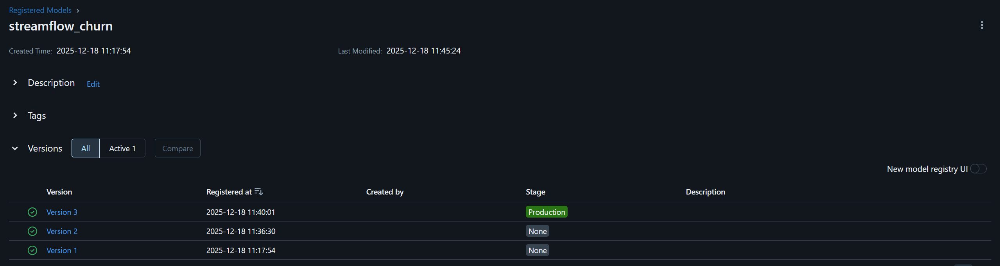
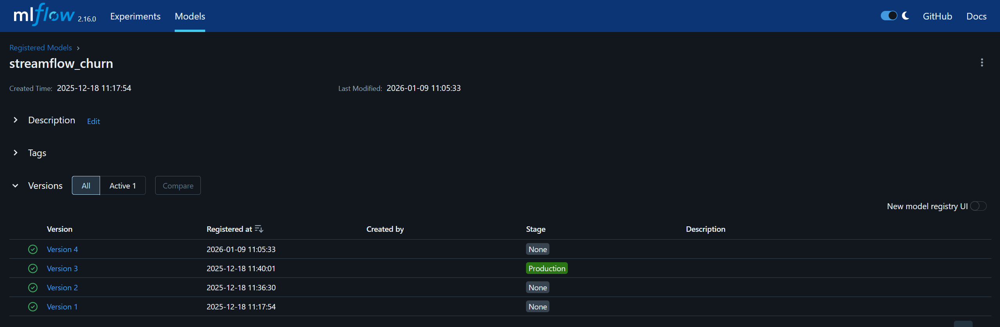
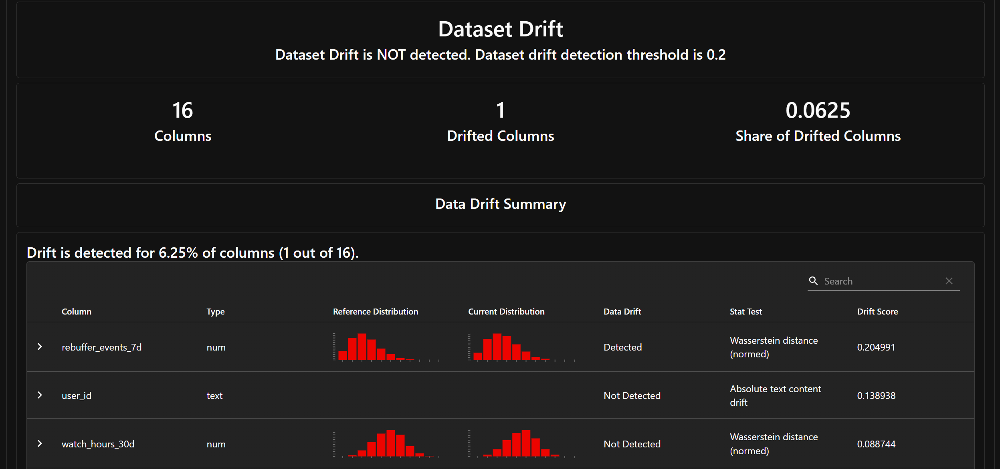
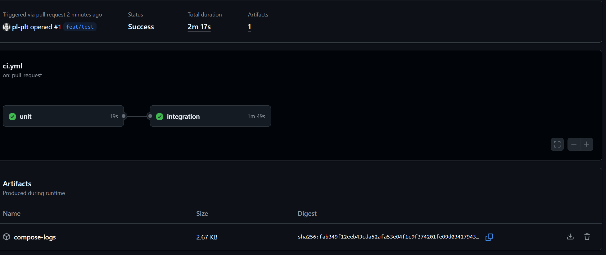

## CI6 : CI/CD pour systèmes ML + réentraînement automatisé + promotion MLflow

Ce sixième TP clôture le cours : vous allez transformer votre pipeline ML “fonctionnel” en un système **continu**, capable de **réentraîner**, **évaluer**, **comparer** et **promouvoir** automatiquement un modèle dans le **MLflow Model Registry**.

L’idée clé est la suivante : en MLOps, déployer le code ne suffit pas. Il faut aussi déployer (et gouverner) le **cycle de vie du modèle**. Dans ce TP, Prefect orchestre la logique métier de réentraînement, tandis que GitHub Actions s’occupe de vérifier que le code s’intègre correctement (CI).

*   Mettre en place un flow Prefect train\_and\_compare\_flow qui entraîne un modèle candidat, l’évalue, le compare au modèle _Production_, et le promeut si nécessaire.
*   Connecter la détection de drift (Evidently) à un réentraînement automatique (drift >= 0.2).
*   Mettre en place une CI GitHub Actions simple : smoke tests + tests unitaires.
*   Produire un rapport d’ingénierie pragmatique dans report/rapport\_tp6.md.

### Mise en place du rapport et vérifications de départ

Ce TP dure 1h30. Vous pouvez terminer le rapport à la maison, mais vous devez lancer les flows et capturer des preuves (captures, logs, commandes) pendant la séance.

Créez le fichier de rapport report/rapport\_tp6.md.

```bash
touch report/rapport_tp6.md
```

Démarrez la stack et vérifiez que les services principaux sont **Up**.

```bash
docker compose up -d 
docker compose ps 
docker compose logs -f api
```

Vérifiez que vous avez déjà un modèle en **Production** dans MLflow.

*   Ouvrez http://localhost:5000
*   Allez dans _Models_ → streamflow\_churn
*   Vérifiez qu’une version est bien au stage _Production_

On suppose dans ce TP que vous avez déjà fait cette promotion manuellement dans le TP précédent.

Dans votre rapport, ajoutez :

*   Un transcript terminal montrant docker compose up -d et docker compose ps
> ```bash
> $ docker compose up -d
> [+] Running 7/7
>  ✔ Container csc8613-postgres-1     Running                                                                   0.0s 
>  ✔ Container csc8613-prefect-1      Running                                                                   0.0s 
>  ✔ Container csc8613-mlflow-1       Running                                                                   0.0s 
>  ✔ Container csc8613-feast-1        Running                                                                   0.0s 
>  ✔ Container csc8613-api-1          Running                                                                   0.0s 
>  ✔ Container streamflow-prometheus  Running                                                                   0.0s 
>  ✔ Container streamflow-grafana     Running                                                                   0.0s 
> $ docker compose ps
> NAME                    IMAGE                           COMMAND                  SERVICE      CREATED             STATUS             PORTS
> csc8613-api-1           csc8613-api                     "uvicorn app:app --h…"   api          About an hour ago   Up About an hour   0.0.0.0:8000->8000/tcp, [::]:8000->8000/tcp
> csc8613-feast-1         csc8613-feast                   "bash -lc 'tail -f /…"   feast        About an hour ago   Up About an hour
> csc8613-mlflow-1        ghcr.io/mlflow/mlflow:v2.16.0   "mlflow server --bac…"   mlflow       3 weeks ago         Up 2 hours         0.0.0.0:5000->5000/tcp, [::]:5000->5000/tcp
> csc8613-postgres-1      postgres:16                     "docker-entrypoint.s…"   postgres     3 weeks ago         Up 2 hours         0.0.0.0:5432->5432/tcp, [::]:5432->5432/tcp
> csc8613-prefect-1       csc8613-prefect                 "/usr/bin/tini -g --…"   prefect      24 minutes ago      Up 24 minutes
> streamflow-grafana      grafana/grafana:11.2.0          "/run.sh"                grafana      2 hours ago         Up 2 hours         0.0.0.0:3000->3000/tcp, [::]:3000->3000/tcp
> streamflow-prometheus   prom/prometheus:v2.55.1         "/bin/prometheus --c…"   prometheus   2 hours ago         Up About an hour   0.0.0.0:9090->9090/tcp, [::]:9090->9090/tcp
> ```
*   Une capture MLflow montrant la version _Production_ au début du TP


### Ajouter une logique de décision testable (unit test)

Pour éviter de tester “directement Prefect + MLflow” dans des tests unitaires, on extrait une fonction pure, facile à tester : should\_promote(new\_auc, prod\_auc, delta).

Créez le fichier services/prefect/compare\_utils.py avec la fonction suivante.

Complétez la condition (TODO).

```python
import math

def should_promote(new_auc: float, prod_auc: float, delta: float = 0.01) -> bool:
    """
    Retourne True si le modèle candidat doit être promu.
    Règle : promotion si prod_auc est NaN (cas rare) OU si new_auc > prod_auc + delta.
    """
    if prod_auc is None:
        return True

    if isinstance(prod_auc, float) and math.isnan(prod_auc):
        return True

    return False  # TODO: implémentez la règle de décision
```

Créez un test unitaire minimal dans tests/unit/test\_compare\_utils.py.

```python
import sys
from pathlib import Path

ROOT = Path(__file__).resolve().parents[2]
sys.path.append(str(ROOT / "services" / "prefect"))

from compare_utils import should_promote

def test_should_promote_when_better_than_prod_plus_delta():
    assert should_promote(new_auc=0.80, prod_auc=0.78, delta=0.01) is True

def test_should_not_promote_when_not_enough_gain():
    assert should_promote(new_auc=0.785, prod_auc=0.78, delta=0.01) is False
```

Lancez les tests localement.

```bash
pip install pytest 
pytest -q
```

Si vous n’avez pas de tests/, créez l’arborescence : mkdir -p tests/unit

Dans votre rapport, ajoutez :

*   Un transcript terminal montrant pytest -q (succès).
> ```bash
> $ pytest -q
> ..                                                                                                          [100%]
> 2 passed in 0.22s```

*   Une phrase expliquant pourquoi on extrait une fonction pure pour les tests unitaires.
> On extrait une fonction pure pour les tests unitaires afin de pouvoir tester la logique de décision indépendamment des dépendances externes telles que Prefect et MLflow. Cela permet de s'assurer que la logique métier est correcte et facilite la maintenance du code.

### Créer le flow Prefect train\_and\_compare\_flow (train → eval → compare → promote)

Vous allez créer un flow autonome qui :

*   Construit un dataset d’entraînement pour un as\_of donné (Feast + labels)
*   Entraîne un modèle candidat et logge val\_auc dans MLflow
*   Évalue le modèle _Production_ sur les mêmes données/split
*   Compare val\_auc et promeut si amélioration >= delta

On garde le système simple : on réutilise RandomForest et la même liste de features.

Créez le fichier services/prefect/train\_and\_compare\_flow.py en partant du code ci-dessous.

```python
import os
import time
from pathlib import Path

import numpy as np
import pandas as pd
from sqlalchemy import create_engine

from feast import FeatureStore

from sklearn.model_selection import train_test_split
from sklearn.metrics import roc_auc_score, f1_score, accuracy_score
from sklearn.ensemble import RandomForestClassifier
from sklearn.compose import ColumnTransformer
from sklearn.preprocessing import OneHotEncoder
from sklearn.pipeline import Pipeline

import mlflow
import mlflow.sklearn
from mlflow.tracking import MlflowClient

from prefect import flow, task

# --- Local helper (unit-tested)
from compare_utils import should_promote

MODEL_NAME = "streamflow_churn"
FEAST_REPO = os.getenv("FEAST_REPO", "/repo")

MLFLOW_TRACKING_URI = os.getenv("MLFLOW_TRACKING_URI", "http://mlflow:5000")
MLFLOW_EXPERIMENT   = os.getenv("MLFLOW_EXPERIMENT", "streamflow")

# Features Feast (identique à votre TP précédent)
FEATURES = [
    "subs_profile_fv:months_active",
    "subs_profile_fv:monthly_fee",
    "subs_profile_fv:paperless_billing",
    "subs_profile_fv:plan_stream_tv",
    "subs_profile_fv:plan_stream_movies",
    "subs_profile_fv:net_service",
    "usage_agg_30d_fv:watch_hours_30d",
    "usage_agg_30d_fv:avg_session_mins_7d",
    "usage_agg_30d_fv:unique_devices_30d",
    "usage_agg_30d_fv:skips_7d",
    "usage_agg_30d_fv:rebuffer_events_7d",
    "payments_agg_90d_fv:failed_payments_90d",
    "support_agg_90d_fv:support_tickets_90d",
    "support_agg_90d_fv:ticket_avg_resolution_hrs_90d",
]

def get_sql_engine():
    uri = (
        f"postgresql+psycopg2://{os.getenv('POSTGRES_USER','streamflow')}:"
        f"{os.getenv('POSTGRES_PASSWORD','streamflow')}@"
        f"{os.getenv('POSTGRES_HOST','postgres')}:5432/"
        f"{os.getenv('POSTGRES_DB','streamflow')}"
    )
    return create_engine(uri)

def fetch_entity_df(engine, as_of: str) -> pd.DataFrame:
    q = """
    SELECT user_id, as_of
    FROM subscriptions_profile_snapshots
    WHERE as_of = %(as_of)s
    """
    df = pd.read_sql(q, engine, params={"as_of": as_of})
    if df.empty:
        raise RuntimeError(f"Aucun snapshot trouvé pour as_of={as_of}")
    df = df.rename(columns={"as_of": "event_timestamp"})
    df["event_timestamp"] = pd.to_datetime(df["event_timestamp"])
    return df[["user_id", "event_timestamp"]]

def fetch_labels(engine, as_of: str) -> pd.DataFrame:
    # Schéma riche (period_start)
    try:
        q = """
        SELECT user_id, period_start, churn_label
        FROM labels
        WHERE period_start = %(as_of)s
        """
        labels = pd.read_sql(q, engine, params={"as_of": as_of})
        if not labels.empty:
            labels = labels.rename(columns={"period_start": "event_timestamp"})
            labels["event_timestamp"] = pd.to_datetime(labels["event_timestamp"])
            return labels[["user_id", "event_timestamp", "churn_label"]]
    except Exception:
        pass

    # Schéma simple
    q2 = "SELECT user_id, churn_label FROM labels"
    labels = pd.read_sql(q2, engine)
    if labels.empty:
        raise RuntimeError("Labels table empty.")
    labels["event_timestamp"] = pd.to_datetime(as_of)
    return labels[["user_id", "event_timestamp", "churn_label"]]

def build_training_df(as_of: str) -> pd.DataFrame:
    eng = get_sql_engine()
    entity_df = fetch_entity_df(eng, as_of)
    labels_df = fetch_labels(eng, as_of)

    store = FeatureStore(repo_path=FEAST_REPO)
    feat_df = store.get_historical_features(entity_df=entity_df, features=FEATURES).to_df()

    df = feat_df.merge(labels_df, on=["user_id", "event_timestamp"], how="inner")
    if df.empty:
        raise RuntimeError("Dataset vide après merge features/labels.")
    return df

def prep_xy(df: pd.DataFrame):
    y = df["churn_label"].astype(int).values
    X = df.drop(columns=["churn_label", "user_id", "event_timestamp"], errors="ignore")
    return X, y

def make_pipeline(df: pd.DataFrame, seed: int):
    cat_cols = [c for c in df.columns if df[c].dtype == "object" and c not in ["user_id","event_timestamp","churn_label"]]
    num_cols = [c for c in df.columns if c not in cat_cols + ["user_id","event_timestamp","churn_label"]]

    preproc = ColumnTransformer(
        transformers=[
            ("cat", OneHotEncoder(handle_unknown="ignore", sparse_output=False), cat_cols),
            ("num", "passthrough", num_cols),
        ],
        remainder="drop"
    )

    clf = RandomForestClassifier(
        n_estimators=300,
        n_jobs=-1,
        random_state=seed,
        class_weight="balanced",
        max_features="sqrt",
    )

    pipe = Pipeline(steps=[("prep", preproc), ("clf", clf)])
    return pipe, cat_cols, num_cols

@task
def train_candidate(as_of: str, seed: int) -> dict:
    mlflow.set_tracking_uri(MLFLOW_TRACKING_URI)
    mlflow.set_experiment(MLFLOW_EXPERIMENT)

    df = build_training_df(as_of)
    X, y = prep_xy(df)

    pipe, cat_cols, num_cols = make_pipeline(df, seed=seed)

    X_train, X_val, y_train, y_val = train_test_split(
        X, y, test_size=0.25, random_state=seed, stratify=y
    )

    with mlflow.start_run(run_name=f"candidate_{as_of}") as run:
        t0 = time.time()
        pipe.fit(X_train, y_train)
        train_time = time.time() - t0

        y_val_proba = pipe.predict_proba(X_val)[:, 1]
        y_val_pred  = pipe.predict(X_val)

        val_auc = roc_auc_score(y_val, y_val_proba)
        val_f1  = f1_score(y_val, y_val_pred)
        val_acc = accuracy_score(y_val, y_val_pred)

        mlflow.log_param("as_of", as_of)
        mlflow.log_param("seed", seed)
        mlflow.log_param("model_type", "RandomForestClassifier")
        mlflow.log_metric("val_auc", float(val_auc))
        mlflow.log_metric("val_f1", float(val_f1))
        mlflow.log_metric("val_acc", float(val_acc))
        mlflow.log_metric("train_time_s", float(train_time))

        mlflow.log_dict(
            {"categorical_cols": cat_cols, "numeric_cols": num_cols},
            "feature_schema.json"
        )

        # Enregistrement dans le Model Registry (nouvelle version au stage "None")
        mlflow.sklearn.log_model(
            sk_model=pipe,
            artifact_path="model",
            registered_model_name=MODEL_NAME,
        )

    # On récupère la version la plus récente du modèle (stage None)
    client = MlflowClient()
    latest_none = client.get_latest_versions(MODEL_NAME, stages=["None"])
    if not latest_none:
        raise RuntimeError("Impossible de retrouver la version candidate (stage None).")
    candidate_version = latest_none[-1].version

    return {
        "candidate_version": candidate_version,
        "val_auc": float(val_auc),
        "val_f1": float(val_f1),
        "val_acc": float(val_acc),
    }

@task
def evaluate_production(as_of: str, seed: int) -> dict:
    """
    Évalue le modèle Production sur les données du mois 'as_of', avec le même split.
    On charge via mlflow.sklearn pour pouvoir utiliser predict_proba (AUC).
    """
    mlflow.set_tracking_uri(MLFLOW_TRACKING_URI)

    client = MlflowClient()
    latest_prod = client.get_latest_versions(MODEL_NAME, stages=["Production"])
    if not latest_prod:
        raise RuntimeError("Aucun modèle en Production : on ne peut pas comparer.")
    prod_version = latest_prod[0].version

    prod_model = mlflow.sklearn.load_model(f"models:/{MODEL_NAME}/Production")

    df = build_training_df(as_of)
    X, y = prep_xy(df)

    _, X_val, _, y_val = train_test_split(
        X, y, test_size=0.25, random_state=seed, stratify=y
    )

    y_val_proba = prod_model.predict_proba(X_val)[:, 1]
    y_val_pred  = prod_model.predict(X_val)

    # TODO: calculez AUC/F1/ACC sur le modèle Production (val set)
    prod_auc = roc_auc_score(...)
    prod_f1  = f1_score(...)
    prod_acc = accuracy_score(...)

    return {
        "prod_version": prod_version,
        "prod_auc": float(prod_auc),
        "prod_f1": float(prod_f1),
        "prod_acc": float(prod_acc),
    }

@task
def compare_and_promote(candidate: dict, production: dict, delta: float) -> str:
    new_auc  = candidate["val_auc"]
    prod_auc = production["prod_auc"]

    print(f"[COMPARE] candidate_auc={new_auc:.4f} vs prod_auc={prod_auc:.4f} (delta={delta:.4f})")

    # TODO: utilisez should_promote(...) pour décider
    decision = "skipped"
    if ...:
        client = MlflowClient()
        client.transition_model_version_stage(
            name=MODEL_NAME,
            version=candidate["candidate_version"],
            stage="Production",
            archive_existing_versions=True
        )
        decision = "promoted"

    print(f"[DECISION] {decision}")
    return decision

@flow(name="train_and_compare")
def train_and_compare_flow(as_of: str, seed: int = 42, delta: float = 0.01):
    """
    Entraîne un modèle candidat sur as_of, évalue Production sur as_of, compare val_auc et promeut si nécessaire.
    """
    cand = train_candidate(as_of, seed)
    prod = evaluate_production(as_of, seed)
    decision = compare_and_promote(cand, prod, delta)

    print(
        f"[SUMMARY] as_of={as_of} cand_v={cand['candidate_version']} "
        f"cand_auc={cand['val_auc']:.4f} prod_v={prod['prod_version']} prod_auc={prod['prod_auc']:.4f} -> {decision}"
    )
    return decision

if __name__ == "__main__":
    # Par défaut, on compare sur month_001 (à adapter si vous avez month_002)
    train_and_compare_flow(as_of="2024-02-29", seed=42, delta=0.01)    
```

Exécutez le flow dans le conteneur Prefect.

```bash
docker compose exec prefect python train_and_compare_flow.py
```

Vous devez voir dans les logs une ligne \[SUMMARY\] indiquant promoted ou skipped.

Vérifiez dans MLflow si une nouvelle version a été promue (si promoted).

*   Ouvrez MLflow UI
*   Regardez le stage _Production_ (nouvelle version ? ancienne archivée ?)

Dans votre rapport, ajoutez :

*   Un transcript des logs du flow (au minimum les lignes \[COMPARE\] et \[SUMMARY\])
> ```bash
>  [COMPARE] candidate_auc=0.8106 vs prod_auc=0.9673 (delta=0.0100)
> [DECISION] skipped
> 10:05:36.102 | INFO    | Task run 'compare_and_promote-500' - Finished in state Completed()
> [SUMMARY] as_of=2024-02-29 cand_v=4 cand_auc=0.8106 prod_v=3 prod_auc=0.9673 -> skipped
> 10:05:36.144 | INFO    | Flow run 'delectable-slug' - Finished in state Completed()
> ```
*   Une capture MLflow montrant le résultat (Production promu ou non)

*   Une phrase expliquant pourquoi on utilise un delta
> On utilise un delta pour éviter de promouvoir un modèle qui n'apporte pas une amélioration significative par rapport au modèle actuel en production.

### Connecter drift → retraining automatique (monitor\_flow.py)

Vous avez déjà un flow de monitoring (Evidently) qui calcule drift\_share. Dans ce TP, on remplace le “RETRAINING\_TRIGGERED (SIMULÉ)” par un vrai appel au flow de réentraînement.

Dans services/prefect/monitor\_flow.py :

*   Gardez les dates par défaut (elles sont correctes dans ce projet).
*   Utilisez un seuil de déclenchement de retrain à **0.02** (pour forcer le réentrainement, à modifier dans le paramètres par défaut de monitor\_month\_flow).
*   Appelez train\_and\_compare\_flow(as\_of=as\_of\_cur) quand drift\_share >= threshold.

Exemple de modification (à adapter dans votre fonction decide\_action) :

```python
from train_and_compare_flow import train_and_compare_flow

@task
def decide_action(as_of_ref: str, as_of_cur: str, drift_share: float, target_drift: float, threshold: float = 0.02) -> str:
    if drift_share >= threshold:
        decision = train_and_compare_flow(as_of=as_of_cur)
        return f"RETRAINING_TRIGGERED drift_share={drift_share:.2f} >= {threshold:.2f} -> {decision}"
    return f"NO_ACTION drift_share={drift_share:.2f} < {threshold:.2f}"
    
```

Vous pouvez laisser le reste du flow identique. Le point important est le branchement drift → retrain.

Exécutez le monitoring (référence month\_000 vs current month\_001) avec un seuil à 0.02.

```bash
docker compose exec prefect python monitor_flow.py
```

Si votre drift réel ne déclenche pas le retrain (drift\_share < 0.02), forcez une exécution “de démonstration” en appelant le flow avec threshold=0.0 (dans le \_\_main\_\_ ou en ajoutant un appel explicite).

Dans votre rapport, ajoutez :

*   Une capture (ou extrait) du rapport Evidently HTML (fichier reports/evidently/drift\_\*.html)

*   Un extrait de logs montrant le message RETRAINING\_TRIGGERED ... et le résultat promoted/skipped
> ```bash
> 10:14:23.249 | INFO    | Task run 'evaluate_production-dc0' - Finished in state Completed()
> [COMPARE] candidate_auc=0.8106 vs prod_auc=0.9673 (delta=0.0100)
> [DECISION] skipped
> 10:14:23.297 | INFO    | Task run 'compare_and_promote-a40' - Finished in state Completed()
> [SUMMARY] as_of=2024-02-29 cand_v=5 cand_auc=0.8106 prod_v=3 prod_auc=0.9673 -> skipped
> 10:14:23.336 | INFO    | Flow run 'masterful-mule' - Finished in state Completed()
> 10:14:23.340 | INFO    | Task run 'decide_action-edd' - Finished in state Completed()
> [Evidently] report_html=/reports/evidently/drift_2024-01-31_vs_2024-02-29.html report_json=/reports/evidently/drift_2024-01-31_vs_2024-02-29.json drift_share=0.06 -> RETRAINING_TRIGGERED drift_share=0.06 >= 0.02 -> skipped        
> 10:14:23.367 | INFO    | Flow run 'snobbish-scorpion' - Finished in state Completed()
> ```

### Redémarrage API pour charger le nouveau modèle Production + test /predict

Votre API charge le modèle au démarrage (MLflow URI models:/streamflow\_churn/Production). Donc si une promotion a eu lieu, il faut redémarrer l’API pour qu’elle recharge la nouvelle version.

Redémarrez uniquement le service API.

```bash
docker compose restart api 
docker compose logs -f api
```

Faites un appel de prédiction sur un user\_id existant.

Vous pouvez récupérer un user\_id depuis un CSV seed (month\_000 ou month\_001).

```bash
head -n 2 data/seeds/month_000/users.csv
# Copiez un user_id réel, puis :
curl -s -X POST "http://localhost:8000/predict" \
  -H "Content-Type: application/json" \
  -d '{"user_id":"TODO_USER_ID"}' | jq
```

Si jq n’est pas disponible, retirez le pipe | jq.

Dans votre rapport, ajoutez :

*   Un transcript curl montrant la réponse JSON

> ```bash
> $ curl -s -X POST "http://localhost:8000/predict" \
>   -H "Content-Type: application/json" \
>   -d '{"user_id":"7590-VHVEG"}' | jq
> {
>  "user_id": "7590-VHVEG",
>  "prediction": 0,
>  "features_used": {
>    "plan_stream_tv": false,
>    "monthly_fee": 29.850000381469727,
>    "paperless_billing": true,
>    "net_service": "DSL",
>    "plan_stream_movies": false,
>    "months_active": 1,
>    "watch_hours_30d": 24.48365020751953,
>    "rebuffer_events_7d": 1,
>    "avg_session_mins_7d": 29.14104461669922,
>    "unique_devices_30d": 3,
>    "skips_7d": 4,
>    "failed_payments_90d": 1,
>    "ticket_avg_resolution_hrs_90d": 16.0,
>    "support_tickets_90d": 0
>  }
> }
*   Une phrase expliquant pourquoi l’API doit être redémarrée
> L'API doit être redémarrée pour qu'elle recharge le nouveau modèle promu en production depuis MLflow. Comme le modèle est chargé au démarrage de l'API, un redémarrage est nécessaire pour que les changements prennent effet.

### CI GitHub Actions (smoke + unit) avec Docker Compose

On vise une CI simple et robuste :

*   Job unit : exécuter pytest sur les tests unitaires rapides
*   Job integration : démarrer la stack via docker compose et faire un healthcheck

On ne fait pas d’entraînement complet en CI (trop lent / non déterministe).

Créez le fichier .github/workflows/ci.yml avec le workflow suivant (à copier-coller).

Note : ce workflow est volontairement minimal et adapté à votre arborescence actuelle (API dans api/).

```yaml
name: CI (Unit + Compose Smoke)

on:
  push:
    branches: [ main ]
  pull_request:

jobs:
  unit:
    runs-on: ubuntu-latest
    steps:
      - uses: actions/checkout@v4

      - name: Set up Python
        uses: actions/setup-python@v5
        with:
          python-version: "3.11"

      - name: Install test deps
        run: |
          pip install pytest

      - name: Run unit tests
        run: |
          pytest -q

  integration:
    runs-on: ubuntu-latest
    needs: unit
    steps:
      - uses: actions/checkout@v4

      - name: Show docker versions
        run: |
          docker version
          docker compose version

      - name: Build and start core stack
        run: |
          docker compose up -d --build postgres feast mlflow api
          docker ps -a

      - name: Wait for API health
        run: |
          for i in $(seq 1 30); do
            if curl -sf http://localhost:8000/health >/dev/null; then
              echo "API is healthy"
              exit 0
            fi
            sleep 2
          done
          echo "API healthcheck failed"
          docker compose logs --no-color > compose-logs.txt || true
          exit 1

      - name: Dump logs (always)
        if: always()
        run: |
          docker compose logs --no-color > compose-logs.txt || true

      - name: Upload logs artifact
        if: always()
        uses: actions/upload-artifact@v4
        with:
          name: compose-logs
          path: compose-logs.txt

      - name: Teardown
        if: always()
        run: |
          docker compose down -v
    
```

Poussez sur GitHub (ou ouvrez une PR) pour déclencher la CI.

Dans GitHub, vérifiez que les deux jobs passent.

Dans votre rapport, ajoutez :

*   Une capture GitHub Actions montrant un run qui passe

*   Une phrase expliquant pourquoi on démarre Docker Compose dans la CI (tests d’intégration multi-services)
> On démarre Docker Compose dans la CI pour effectuer des tests d'intégration multi-services. Cela permet de vérifier que tous les services interagissent correctement entre eux dans un environnement similaire à la production, assurant ainsi la robustesse et la fiabilité du système global.

### Synthèse finale : boucle complète drift → retrain → promotion → serving

Dans votre rapport, écrivez une synthèse courte (½ page) qui explique :

*   Comment le drift est mesuré et le rôle du seuil 0.02 (en pratique, plus élevé)
*   Comment le flow train\_and\_compare\_flow compare val\_auc et décide une promotion
*   Ce qui relève de Prefect vs GitHub Actions

Ajoutez une petite section “limites / améliorations” :

*   Pourquoi la CI ne doit pas entraîner le modèle complet
*   Quels tests manquent
*   Pourquoi l’approbation humaine / gouvernance est souvent nécessaire en vrai

> ## Synthèse finale
> ### Comment le drift est mesuré et le rôle du seuil 0.02
> Le drift est mesuré à l'aide d'Evidently, qui compare les distributions des caractéristiques entre deux périodes (référence et actuelle). Le seuil de 0.02 est utilisé pour déclencher un réentraînement lorsque le pourcentage de caractéristiques présentant un drift dépasse ce seuil, indiquant un changement significatif dans les données.
> ### Comment le flow train_and_compare_flow compare val_auc et décide une promotion
> Le flow train_and_compare_flow entraîne un modèle candidat sur les données actuelles, évalue le modèle en production sur les mêmes données, puis compare les scores AUC de validation. Si le score AUC du modèle candidat dépasse celui du modèle en production de plus d'un certain delta (0.01), le modèle candidat est promu en production.
> ### Ce qui relève de Prefect vs GitHub Actions
> Prefect est utilisé pour orchestrer les workflows de réentraînement, d'évaluation et de promotion des modèles, tandis que GitHub Actions est utilisé pour la CI, assurant que le code passe les tests unitaires et d'intégration avant d'être déployé.
> ### Limites / améliorations
> - La CI ne doit pas entraîner le modèle complet car cela peut être long et non déterministe, ce qui ralentirait le processus de validation du code.
> - Des tests d'intégration plus approfondis pourraient être ajoutés pour vérifier le bon fonctionnement des interactions entre les différents services.
> - L'approbation humaine est souvent nécessaire pour garantir que les modèles promus respectent les normes éthiques, réglementaires et de performance avant d'être déployés en production.


Pushez votre dépôt avec le tag TP6.